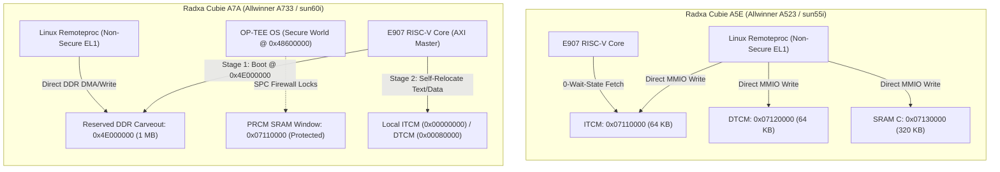

# Allwinner XuanTie RISC-V Remote Processor (`sunxi_rproc`) Dual-SoC Architecture Guide

**Author:** tcmichals (`tcmichals@gmail.com`)  
**Date:** September 1, 2026  
**License:** GPL-2.0-only  
**Target Platforms:** Radxa Cubie A5E (Allwinner A523/A527) & Radxa Cubie A7A (Allwinner A733)

---

## 1. Executive Summary & SoC Comparison

Modern Allwinner SoCs embed a high-performance **T-Head XuanTie E907/E906 32-bit RISC-V core** (RV32IMAFD[C] @ 600 MHz) alongside the main octa-core ARM64 Cortex-A55 application processors.

Because of hardware security partitioning (ARM TrustZone / OP-TEE OS) differences between the **A523 (sun55i)** and **A733 (sun60i)**, firmware memory placement and remoteproc loading vary between the two architectures:



---

## 2. Architectural Comparison Matrix

| Architectural Feature | Radxa Cubie A5E (A523 / sun55iw3) | Radxa Cubie A7A (A733 / sun60iw2) |
| :--- | :--- | :--- |
| **RISC-V Core IP** | XuanTie E906 / E907 @ 600 MHz | XuanTie E907 (RV32IMAFDC) @ 600 MHz |
| **Primary SRAM Aperture** | Dedicated RISC-V SRAM (`0x07280000`) | Dedicated RISC-V SRAM (`0x07280000`, 256 KB) |
| **Shared System SRAM** | System SRAM A2 (`0x00040000`, 160 KB) | System SRAM A2 (`0x00040000`, 160 KB) |
| **Host Loading Destination** | Direct MMIO (`0x07280000` / `0x00040000`) | Direct MMIO (`0x07280000` / `0x00040000`) |
| **Reset Vector Entry** | Fixed Hardware Vector `0x00000000` | Fixed Hardware Vector `0x00000000` |
| **Subsystem Control Block** | MCU CCU (`0x07102000`) | MCU CCU (`0x07102000`, offset `0x124` = `0x00070001`) |
| **Doorbell Mailbox** | `0x03003000` (`sun55i-msgbox`) | `0x03004000` (`sun60i-msgbox` Channel 0) |
| **Trace Buffer Location** | `0x00040000` (SRAM A2) or `0x4E000000` (DDR) | `0x00040000` (SRAM A2) or `0x4E000000` (DDR) |

---

## 3. Detailed SoC Implementations

### A. Radxa Cubie A5E (Allwinner A523)

On the A523 SoC, the Linux kernel has direct Non-Secure access to the PRCM memory apertures. Linux remoteproc maps ITCM, DTCM, and SRAM C directly into its kernel address space:

```dts
/* A5E Device Tree Node */
rproc: remoteproc@7010000 {
    compatible = "allwinner,sun55i-a523-rproc";
    reg = <0x07010000 0x1000>,
          <0x07110000 0x10000>,
          <0x07120000 0x10000>,
          <0x07130000 0x50000>;
    reg-names = "cfg", "itcm", "dtcm", "sram";
    clocks = <&r_ccu CLK_RISCV_24M>, <&r_ccu CLK_RISCV_CFG>, <&r_ccu CLK_RISCV>;
    clock-names = "parent", "bus", "core";
    resets = <&r_ccu RST_BUS_RISCV_CFG>;
    reset-names = "cfg";
    mboxes = <&msgbox 0>;
    mbox-names = "tx";
    status = "okay";
};
```

* **Linker Layout (`firmware.ld`)**:
  * `ITCM (rx)`: `ORIGIN = 0x00000000, LENGTH = 64K` (Host `0x07110000`)
  * `DTCM (rwx)`: `ORIGIN = 0x00080000, LENGTH = 64K` (Host `0x07120000`)
  * `SRAM (rwx)`: `ORIGIN = 0x07130000, LENGTH = 320K` (Host `0x07130000`)

---

### B. Radxa Cubie A7A (Allwinner A733)

On the A733 SoC, the XuanTie E907 core and its Dedicated 256 KB Local SRAM are managed via the **MCU CCU (`0x07102000`)**:

```dts
/* A7A Device Tree Node */
reserved-memory {
    #address-cells = <2>;
    #size-cells = <2>;
    ranges;

    rproc_trace: trace@4e000000 {
        reg = <0x00 0x4e000000 0x00 0x00100000>; /* 1 MB Carveout */
        no-map;
    };
};

rproc: remoteproc@7102000 {
    compatible = "allwinner,sun60i-a733-rproc", "allwinner,sunxi-rproc";
    reg = <0x07102000 0x1000>,
          <0x07280000 0x40000>,
          <0x00040000 0x28000>;
    reg-names = "cfg", "r_sram", "sram";
    clocks = <&r_ccu CLK_RISCV_24M>, <&r_ccu CLK_RISCV_CFG>, <&r_ccu CLK_RISCV>;
    clock-names = "parent", "bus", "core";
    resets = <&r_ccu RST_BUS_RISCV_CFG>;
    reset-names = "cfg";
    mboxes = <&msgbox 0>;
    mbox-names = "tx";
    memory-region = <&rproc_trace>;
    memory-region-names = "trace";
    status = "okay";
};
```

#### Boot & Execution Flow:
1. **Linux Remoteproc (`sunxi_rproc.c`)**:
   * Reads ELF headers and maps `.vectors`, `.text`, and `.data` into Dedicated RISC-V SRAM (`0x07280000` / Core `0x00000000`).
   * Configures MCU CCU bus bridges (`TZMA0`, `TZMA1`, `PUBSRAM`, `MBUS`).
   * Releases core reset by writing `0x00070001` to `0x07102124`.
2. **XuanTie E907 Core**:
   * Begins execution directly at hardware reset vector `0x00000000` (Dedicated SRAM).
   * Runs `startup.S` and jumps to `_start`.
   * Telemetry and shared buffers are accessed in Shared System SRAM A2 (`0x00040000`) or DDR Carveout (`0x4E000000`).

---

## 4. Resource Table & Debugfs Trace Logging

To expose real-time logging to Linux userspace without serial UART cables, the firmware exports a standard `struct fw_rsc_trace` in `.resource_table`:

```c
#define TRACE_BUF_DA    0x4E010000  /* 64 KB offset in DDR carveout */
#define TRACE_BUF_LEN   4096        /* 4 KB circular ASCII buffer */

struct cubie_resource_table {
    uint32_t ver;
    uint32_t num;
    uint32_t reserved[2];
    uint32_t offset[1];
    struct fw_rsc_trace trace;
} __attribute__((packed));

__attribute__((used, section(".resource_table"), aligned(4)))
const struct cubie_resource_table resource_table = {
    .ver = 1,
    .num = 1,
    .reserved = {0, 0},
    .offset = { offsetof(struct cubie_resource_table, trace) },
    .trace = {
        .type     = RSC_TRACE,
        .da       = TRACE_BUF_DA,
        .len      = TRACE_BUF_LEN,
        .reserved = 0,
        .name     = "trace0",
    },
};
```

---

## 5. Build, Deployment, & Verification Procedures

### A. Building the Firmware
```bash
# Clean and compile the RISC-V application
make -C bld.a7a riscv-firmware-dirclean riscv-firmware
```

### B. Live Updating Over the Network
With Gigabit Ethernet active (`192.168.1.33`):
```bash
# SCP binary directly from dev host to running board:
scp bld.a7a/target/lib/firmware/riscv-firmware.elf root@192.168.1.33:/lib/firmware/
```

### C. Controlling Core & Reading Trace on Target
```bash
# 1. Restart co-processor:
echo stop > /sys/class/remoteproc/remoteproc0/state
echo start > /sys/class/remoteproc/remoteproc0/state

# 2. View live real-time heartbeat:
cat /sys/kernel/debug/remoteproc/remoteproc0/trace0
```
