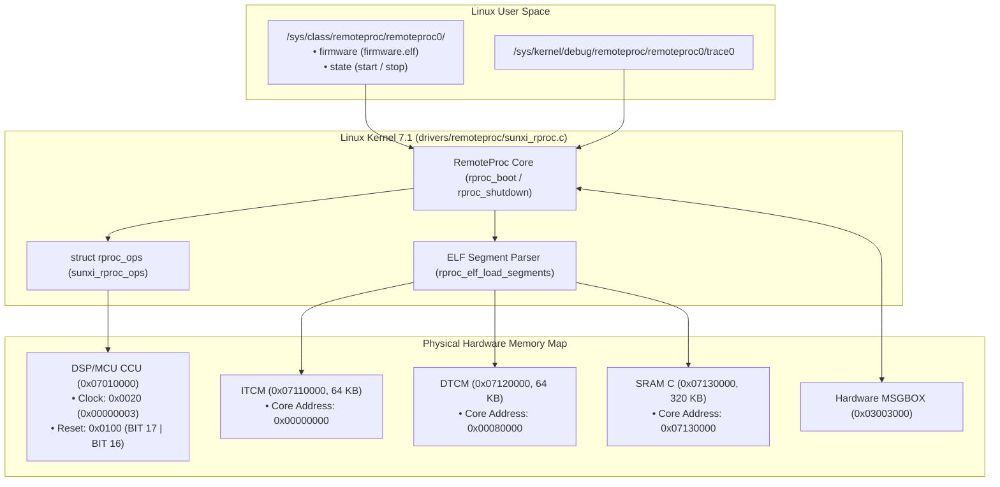

# Allwinner XuanTie RISC-V Remote Processor (`sunxi_rproc`) Guide & Patch Documentation

**Author:** tcmichals (`tcmichals@gmail.com`)  
**Date:** August 19, 2026  
**License:** GPL-2.0-only  
**Copyright:** Copyright (C) 2024–2026 Allwinner Technology Co., Ltd. & Copyright (C) 2026 tcmichals

---

## 1. Overview & Architecture

Modern Allwinner SoCs (**A523**, **A527 / T527**, and **A733**) feature an embedded **XuanTie E907/E902 RISC-V co-processor** (RV32IMAC @ 600 MHz) alongside the main ARM64 application cores.

The [`sunxi_rproc.c`](file:///home/tcmichals/projects/cubie/cubie-a5e/project-cubie-a5e/patches/linux/0002-remoteproc-sunxi-add-allwinner-riscv-remoteproc.patch) driver integrates this co-processor into the standard **Linux 7.1 Remote Processor (`remoteproc`) Framework**, allowing standard user-space firmware loading, lifecycle management, trace logging, and RPMsg IPC.



---

## 2. Hardware Physical Memory Map

| Region | ARM Physical Address | RISC-V Core Address | Size | Description |
| :--- | :--- | :--- | :--- | :--- |
| **DSP CCU** | `0x07010000` | `0x40010000` | 4 KB | Clock gate (`0x20`) and Reset control (`0x100`) |
| **ITCM** | `0x07110000` | `0x00000000` | 64 KB | Instruction TCM (Fast zero-wait execution) |
| **DTCM** | `0x07120000` | `0x00080000` | 64 KB | Data TCM (Fast zero-wait data & stack) |
| **SRAM C** | `0x07130000` | `0x07130000` | 320 KB | Shared SRAM window for ring buffers & IPC |
| **MSGBOX** | `0x03003000` | `0x40030000` | 4 KB | Hardware 8-channel Mailbox Doorbell |

---

## 3. Remoteproc Patch Implementation Details

The standalone kernel patch is located at:  
[`project-cubie-a5e/patches/linux/0002-remoteproc-sunxi-add-allwinner-riscv-remoteproc.patch`](file:///home/tcmichals/projects/cubie/cubie-a5e/project-cubie-a5e/patches/linux/0002-remoteproc-sunxi-add-allwinner-riscv-remoteproc.patch)

### A. Core Lifecycle Operations (`struct rproc_ops`)

```c
static int sunxi_rproc_start(struct rproc *rproc)
{
    struct sunxi_rproc *priv = rproc->priv;

    /* 1. Assert DSP Subsystem Bus Clocks */
    writel(0x00000003, priv->ccu_base + CCU_DSP_CLK_REG);

    /* 2. De-assert Subsystem Reset while holding Core in Reset */
    writel(DSP_RST_SYS_DEASSERT, priv->ccu_base + CCU_DSP_RST_REG);

    /* 3. Release RISC-V Core Reset to start execution */
    writel(DSP_RST_SYS_DEASSERT | DSP_RST_CORE_DEASSERT, priv->ccu_base + CCU_DSP_RST_REG);

    return 0;
}

static int sunxi_rproc_stop(struct rproc *rproc)
{
    struct sunxi_rproc *priv = rproc->priv;

    /* Hold Core in Reset */
    writel(DSP_RST_SYS_DEASSERT, priv->ccu_base + CCU_DSP_RST_REG);

    return 0;
}
```

### B. Device Address Translation (`da_to_va`)

Maps ELF segments linked for the XuanTie core into host ARM physical virtual addresses:

```c
static void *sunxi_rproc_da_to_va(struct rproc *rproc, u64 da, size_t len, bool *is_iomem)
{
    struct sunxi_rproc *priv = rproc->priv;

    if (is_iomem)
        *is_iomem = true;

    /* Map ITCM: Core 0x00000000 -> Host 0x07110000 */
    if (da >= 0x00000000 && (da + len) <= (0x00000000 + ITCM_SIZE))
        return priv->itcm_base + (da - 0x00000000);

    /* Map DTCM: Core 0x00080000 -> Host 0x07120000 */
    if (da >= 0x00080000 && (da + len) <= (0x00080000 + DTCM_SIZE))
        return priv->dtcm_base + (da - 0x00080000);

    /* Map SRAM C: Core 0x07130000 -> Host 0x07130000 */
    if (da >= 0x07130000 && (da + len) <= (0x07130000 + SRAM_SIZE))
        return priv->sram_base + (da - 0x07130000);

    return NULL;
}
```

---

## 4. Device Tree Binding

In `arch/arm64/boot/dts/allwinner/sun60i-a733-cubie-a7a.dts` (or `sun55i-a527`):

```dts
rproc: remoteproc@7010000 {
    compatible = "allwinner,sun60i-a733-rproc", "allwinner,sun55i-a527-rproc";
    reg = <0x00 0x07010000 0x00 0x1000>,  /* CCU Base */
          <0x00 0x07110000 0x00 0x10000>, /* ITCM (64 KB) */
          <0x00 0x07120000 0x00 0x10000>, /* DTCM (64 KB) */
          <0x00 0x07130000 0x00 0x50000>; /* SRAM C (320 KB) */
    reg-names = "ccu", "itcm", "dtcm", "sram";
    status = "okay";
};
```

---

## 5. User-Space Operating Runbook

### A. Building the Bare-Metal RISC-V Firmware
```bash
cd /home/tcmichals/projects/cubie/cubie-a5e/riscv-firmware
make
# Produces: firmware.elf
```

### B. Loading Firmware & Starting Remoteproc
```bash
# 1. Copy ELF to kernel firmware search path
cp firmware.elf /lib/firmware/riscv_firmware.elf

# 2. Tell remoteproc driver which file to load
echo riscv_firmware.elf > /sys/class/remoteproc/remoteproc0/firmware

# 3. Boot the XuanTie RISC-V core
echo start > /sys/class/remoteproc/remoteproc0/state

# 4. Check kernel dmesg
dmesg | tail -n 20

# 5. Read real-time printk trace buffer from RISC-V
cat /sys/kernel/debug/remoteproc/remoteproc0/trace0
```

### C. Stopping Remoteproc
```bash
echo stop > /sys/class/remoteproc/remoteproc0/state
```

---

## 6. Upstream Mailing List Submission Details

* **RFC Series Header:** `[RFC PATCH 0/2] remoteproc: sunxi: add Allwinner XuanTie RISC-V remoteproc driver`
* **Maintainers:**
  * Mathieu Poirier (`mathieu.poirier@linaro.org`) & Bjorn Andersson (`andersson@kernel.org`)
  * Chen-Yu Tsai (`wens@csie.org`) & Jernej Skrabec (`jernej.skrabec@gmail.com`)
* **Mailing Lists:**
  * `linux-remoteproc@vger.kernel.org`
  * `linux-sunxi@lists.linux.sunxi.org`
  * `linux-arm-kernel@lists.infradead.org`
