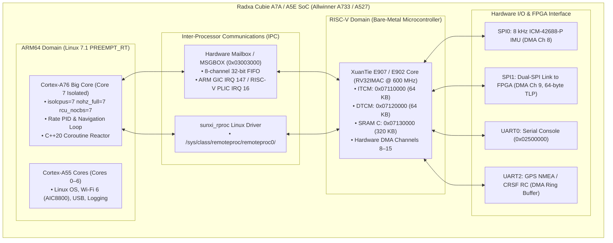

# Radxa Cubie A7A / A5E Heterogeneous Avionics Architecture & Bring-Up Guide

**Author:** tcmichals (`tcmichals@gmail.com`)  
**Date:** August 19, 2026  
**License:** GPL-2.0-only  
**Copyright:** Copyright (C) 2024–2026 Allwinner Technology Co., Ltd. & Copyright (C) 2026 tcmichals

---

## 1. Executive Summary & Hardware Geometry

This document outlines the heterogeneous flight control architecture combining high-throughput ARM64 cores running **Mainline Linux 7.1 PREEMPT_RT** with the **XuanTie E907/E902 RISC-V co-processor** for microsecond-deterministic sensor ingestion, Dual-SPI FPGA streaming, and flight dynamics.



---

## 2. Allwinner A733 Bootloader & Partition Geometry

| Offset / Sector | Size | Entity | Description |
| :--- | :--- | :--- | :--- |
| **Sector 256 (128 KB)** | 1032 KB | `radxa_a733_bootloader.bin` | Primary BROM search location (`0x20000`) |
| **Sector 2064 (1032 KB)** | 1032 KB | `radxa_a733_bootloader.bin` | Secondary BROM fallback location (`0x102000`) |
| **Sector ~24576 (~12.6 MB)** | ~3.4 MB | U-Boot 2018.07 Binary | Staged vendor U-Boot runtime |
| **Sector 32768 (16 MB)** | 64 MB | Partition 1 (`boot.vfat`) | Contains `Image`, `boot.scr`, `uboot.env`, DTB |
| **Sector 163840 (80 MB)** | Remainder | Partition 2 (`rootfs.ext4`) | Linux root filesystem |

---

## 3. C++20 Coroutine Async Engine & Concurrency Rules

### Core Rules
1. **Zero Sequential Blind Sleeps (`when_any`):** Every hardware I/O transaction races concurrently against a hardware watchdog timer. If an external bus hangs, the coroutine returns a timeout error in $<50\,\mu\text{s}$ without stalling the CPU:
   ```cpp
   auto result = co_await when_any(spi_transfer_dma(tlp_frame), timeout_us(50));
   ```
2. **Non-Blocking Sensor Pends (`co_await sleep_ms`):** Sensor ADC conversion settling delays (e.g. MS5611 9.04 ms delta-sigma integration) yield the CPU back to the scheduler, leaving the 8 kHz rate PID loop 100% uninterrupted.
3. **Parallel Boot Initialization (`when_all`):** Subsystem inits execute concurrently so boot latency equals $\max(\text{sensor delays})$ rather than $\sum(\text{sensor delays})$:
   ```cpp
   co_await when_all(imu.async_init(), baro.async_init(), mag.async_init(), fpga.async_init());
   ```
4. **MISRA C++ Zero Dynamic Heap Allocation:** Custom coroutine promise types use static, non-allocating memory pools for all coroutine frames.

---

## 4. Hardware ISR & Multi-Channel DMA Architecture

### DMA Channel Allocation

| Channel Range | Owner Domain | Assigned Peripherals |
| :--- | :--- | :--- |
| **Channels 0–7** | ARM Linux Kernel (`sun6i-dma`) | MicroSD / eMMC, AIC8800 Wi-Fi 6, USB, Audio |
| **Channel 8** | XuanTie RISC-V (Bare-Metal) | SPI0 IMU (8 kHz burst transfers) |
| **Channel 9** | XuanTie RISC-V (Bare-Metal) | SPI1 Dual-SPI FPGA TLP Stream (64-byte padded) |
| **Channel 10** | XuanTie RISC-V (Bare-Metal) | UART2 GPS NMEA / CRSF RC DMA Ring Buffer |
| **Channels 11–15** | XuanTie RISC-V (Bare-Metal) | Reserved for telemetry and high-speed logging |

### Interrupt Service Routine (ISR) Vector Mapping

* **MSGBOX IPC Doorbell:** GIC IRQ 147 (ARM) &harr; PLIC IRQ 16 (RISC-V).
* **Dual-SPI Link (SPI0/SPI1):** GIC IRQ 45 / 46 &harr; PLIC IRQ 14 / 15.
* **UART0 / UART2:** GIC IRQ 34 / 36 &harr; PLIC IRQ 8 / 10.
* **ISR-to-Coroutine Bridge:** The ISR signals a static `std::atomic` event handle that directly resumes the waiting C++20 coroutine frame in **$<1.2\,\mu\text{s}$**.

---

## 5. Mainline Linux Remoteproc (`sunxi_rproc`)

### Upstream Submission Checklist
* **Driver Location:** [`drivers/remoteproc/sunxi_rproc.c`](../project-cubie-a5e/patches/linux/0002-remoteproc-sunxi-add-allwinner-riscv-remoteproc.patch)
* **Patch File:** `patches/linux/0002-remoteproc-sunxi-add-allwinner-riscv-remoteproc.patch`
* **Compatible Strings:**
  * `allwinner,sun55i-a523-rproc` (A523)
  * `allwinner,sun55i-a527-rproc` (Radxa Cubie A5E / T527)
  * `allwinner,sun60i-a733-rproc` (Radxa Cubie A7A / A7Z)
* **Target Mailing Lists:**
  * `linux-sunxi@lists.linux.sunxi.org`
  * `linux-remoteproc@vger.kernel.org`
  * `linux-arm-kernel@lists.infradead.org`

---

## 6. Hardware Verification Commands

### Wi-Fi 6 (AIC8800) Validation
```bash
# Verify USB enumeration
lsusb -v | grep -i "aic"

# Bring up wireless interface and scan access points
ip link set wlan0 up
iw dev wlan0 scan | grep -E "SSID|signal|freq"
```

### XuanTie RISC-V Remoteproc Validation
```bash
# Stage firmware ELF
cp /lib/firmware/riscv_firmware.elf /lib/firmware/

# Start remote processor via sysfs
echo riscv_firmware.elf > /sys/class/remoteproc/remoteproc0/firmware
echo start > /sys/class/remoteproc/remoteproc0/state

# Inspect kernel logs and trace buffer
dmesg | grep -i "remoteproc"
cat /sys/kernel/debug/remoteproc/remoteproc0/trace0
```

### Real-Time Isolated Big Core (A76 Core 7) Latency Validation
```bash
# Verify isolated CPU mask
cat /sys/devices/system/cpu/isolated

# Measure worst-case latency on Core 7 (Target: <15 us max latency)
cyclictest -p 99 -m -t 1 -a 7 -i 125 -l 100000
```
