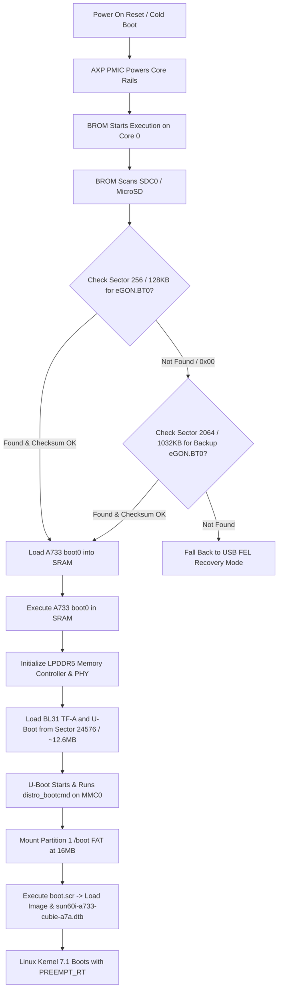

# Allwinner A733 (sun60i) Boot Architecture & Disk Layout Specification

This document details the low-level boot sequence, BootROM (BROM) requirements, memory maps, and disk partition geometry for the **Radxa Cubie A7A** powered by the **Allwinner A733 (`sun60i`)** processor. It highlights the critical architectural differences between the **A733 (`sun60i`)** and legacy Allwinner platforms including the **A527/T527 (`sun55i`)**.

---

## 1. Executive Summary & Critical Differences

| Parameter | Allwinner T527 / A527 (`sun55i`) | Allwinner A733 (`sun60i`) |
| :--- | :--- | :--- |
| **SoC Architecture** | `sun55iw3` (8× Cortex-A55) | `sun60iw2` (2× Cortex-A76 + 6× Cortex-A55) |
| **DRAM Controller & PHY** | LPDDR4 / LPDDR4X | **LPDDR5** |
| **BROM Boot Signature Search Offset** | **8 KB** (`0x2000` / Sector 16) | **128 KB** (`0x20000` / Sector 256) |
| **Secondary/Backup BROM Offset** | N/A | **1032 KB** (`0x102000` / Sector 2064) |
| **Bootloader Footprint** | ~880 KB (Single monolithic blob) | **~14 MB** (Multi-stage: `boot0` + U-Boot Proper) |
| **U-Boot Binary Offset** | Included at 8 KB offset | **~12.6 MB** (`0xCA0F0F` / Sector ~24576) |
| **Partition 1 (`boot.vfat`) Safe Offset** | **4 MB** (`offset = 4M` / Sector 8192) | **16 MB** (`offset = 16M` / Sector 32768) |
| **Mainline U-Boot Status (v2026.01)** | Fully Supported (`radxa-cubie-a5e_defconfig`) | Requires Vendor A733 Bootloader Blob |
| **Mainline TF-A Platform** | `sun55i_a523` | Vendor BL31 (`sun60i`) |

---

## 2. BootROM (BROM) Hardware Execution Sequence

When the Allwinner A733 powers on, CPU Core 0 executes internal silicon ROM code in the following order:



### Why Legacy 8 KB Images Fail to Boot
1. On legacy chips (A10, A20, A64, H3, H5, H6, H616, A527/T527), the BROM checks sector 16 (8 KB).
2. On the **A733 (`sun60i`)**, the BROM intentionally skips the first 128 KB to maintain full compatibility with GPT partition tables (which occupy sectors 1–33).
3. If an SD card image places `u-boot-sunxi-with-spl.bin` at 8 KB, the A733 BROM reads 0s at 128 KB and 1032 KB, rejects the card, and falls back to **FEL mode** (emitting binary status bytes on `UART0` and waiting for USB-C FEL connection).

---

## 3. SD Card Physical Sector & Disk Layout Geometry

```text
=============================================================================================================
  BYTE OFFSET       SECTOR (512B)   REGION NAME               CONTENTS / FUNCTION
=============================================================================================================
  0x00000000        Sector 0        Protective MBR            Partition table container (holes = "(440; 512)")
  0x00000200        Sectors 1–33    GPT Structures            GPT Header and 128 Partition Array Entries
  0x00004200        Sectors 34–255  Unallocated Gap           Reserved buffer
  0x00020000        Sector 256      Primary eGON.BT0 (128 KB) Allwinner A733 boot0 (LPDDR5 memory trainer)
  0x00102000        Sector 2064     Backup eGON.BT0 (1032 KB) Redundant fallback boot0
  0x00CA0F0F        Sector ~24576   U-Boot 2018.07 (~12.6 MB) Full U-Boot binary + ARM Trusted Firmware BL31
  0x01000000        Sector 32768    PARTITION 1 (16 MB Offset) boot.vfat (64 MB):
                                                               - boot.scr (Compiled U-Boot script)
                                                               - Image (Linux 7.1 ARM64 kernel)
                                                               - sun60i-a733-cubie-a7a.dtb
                                                               - cubie-a7a-flight-stack.dtbo
                                                               - uboot.env (Environment configuration)
  0x05000000        Sector 163840   PARTITION 2 (80 MB Offset) rootfs.ext4 (512 MB Root Filesystem)
=============================================================================================================
```

---

## 4. Buildroot Integration & Configuration Rules

### 1. Genimage Configuration (`board/radxa/cubie_a7a/genimage.cfg`)
To embed the verified 16MB bootloader blob without corrupting the partition table:
```cfg
image boot.vfat {
    vfat {
        files = {
            "sun60i-a733-cubie-a7a.dtb",
            "cubie-a7a-flight-stack.dtbo",
            "boot.scr",
            "Image",
            "uboot.env"
        }
    }
    size = 64M
}

image sdcard.img {
    hdimage {}

    partition u-boot {
        in-partition-table = false
        image = "radxa_a733_bootloader.bin"
        offset = 0
        holes = {"(440; 512)"}
    }

    partition boot {
        partition-type = 0xC
        bootable = "true"
        image = "boot.vfat"
        offset = 16M
    }

    partition rootfs {
        partition-type = 0x83
        image = "rootfs.ext4"
    }
}
```

### 2. Post-Image Script (`board/radxa/cubie_a7a/post-image.sh`)
```bash
#!/bin/sh
BOARD_DIR="$(dirname $0)"
GENIMAGE_CFG="${BOARD_DIR}/genimage.cfg"
GENIMAGE_TMP="${BUILD_DIR}/genimage.tmp"

# Compile boot.cmd into boot.scr using host mkimage
${HOST_DIR}/bin/mkimage -A arm64 -T script -C none -d "$(dirname $0)/boot.cmd" "${BINARIES_DIR}/boot.scr"

# Compile uboot-env.txt into uboot.env binary using host mkenvimage
${HOST_DIR}/bin/mkenvimage -s 0x10000 -o "${BINARIES_DIR}/uboot.env" "$(dirname $0)/uboot-env.txt"

# Stage verified vendor A733 bootloader binary into BINARIES_DIR
cp -f "${BOARD_DIR}/radxa_a733_bootloader.bin" "${BINARIES_DIR}/radxa_a733_bootloader.bin"

# Run genimage packaging pipeline
rm -rf "${GENIMAGE_TMP}"
genimage --config "${GENIMAGE_CFG}" --rootpath "${TARGET_DIR}" --tmppath "${GENIMAGE_TMP}" --inputpath "${BINARIES_DIR}" --outputpath "${BINARIES_DIR}"

exit 0
```

---

## 5. Memory Map & Kernel Boot Arguments

The vendor U-Boot and `uboot-env.txt` share identical memory placement in RAM (DRAM Base: `0x40000000`):

| Variable | Address | Description |
| :--- | :--- | :--- |
| `kernel_addr_r` | `0x40080000` | Target memory address for uncompressed Linux `Image` |
| `kernel_comp_addr_r`| `0x44000000` | Working address for compressed kernel decompression |
| `fdt_addr_r` | `0x4FA00000` | Base Device Tree Blob (`sun60i-a733-cubie-a7a.dtb`) |
| `scriptaddr` | `0x4FC00000` | U-Boot script execution slot (`boot.scr`) |
| `pxefile_addr_r` | `0x4FD00000` | Network PXE boot slot |
| `fdtoverlay_addr_r` | `0x4FE00000` | Device Tree Overlay working slot |
| `ramdisk_addr_r` | `0x4FF00000` | Flight overlay staging slot (`cubie-a7a-flight-stack.dtbo`) |

### Standard Boot Command (`boot.cmd`)
```bash
setenv bootargs console=ttyS0,115200 earlycon root=/dev/mmcblk0p2 rootwait panic=10 iomem=relaxed isolcpus=7 nohz_full=7 rcu_nocbs=7

# Load base DTB
load mmc 0:1 ${fdt_addr_r} sun60i-a733-cubie-a7a.dtb

# Load flight stack overlay
load mmc 0:1 ${ramdisk_addr_r} cubie-a7a-flight-stack.dtbo

# Apply overlay dynamically
fdt addr ${fdt_addr_r}
fdt resize 65536
fdt apply ${ramdisk_addr_r}

# Load and execute Linux 7.1 kernel
load mmc 0:1 ${kernel_addr_r} Image
booti ${kernel_addr_r} - ${fdt_addr_r}
```

---

## 6. How to Re-Extract the Bootloader Blob from Stock Images

If updating the vendor bootloader from a new official Radxa release image (`.img` or `.img.xz`):

```bash
# Decompress and extract the first 16MB raw header
xz -dc radxa-a733_bullseye_kde_r6.output_512.img.xz | head -c 16777216 > project-cubie-a5e/board/radxa/cubie_a7a/radxa_a733_bootloader.bin

# Verify eGON signature at 128KB (0x20000)
hexdump -C -s 131072 -n 32 project-cubie-a5e/board/radxa/cubie_a7a/radxa_a733_bootloader.bin

# Expected output:
# 00020000  be 02 00 ea 65 47 4f 4e  2e 42 54 30 df cb c0 d6  |....eGON.BT0....|
```
