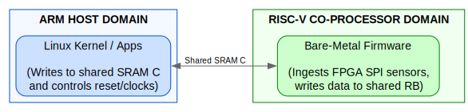
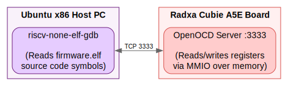

# RISC-V Co-processor Programming & Bring-up Guide

This guide explains the architecture of the **XuanTie E906/E907 RISC-V co-processor** on the Radxa Cubie A5E, detailing its memory interfaces, firmware compilation flow, boot-up sequence, and inter-processor communication.

---

## 1. Co-Processor Architecture

The Allwinner T527 SoC integrates a **XuanTie E907** as its real-time co-processor. It is a high-determinism, low-power RISC-V processor designed exclusively to handle time-critical attitude estimation and flight control loops (such as iNAV/Betaflight threads), completely isolated from the Linux OS domain running on the ARM Cortex-A55 cores.

### Hardware Specifications
* **Clock Speed:** Runs at **600 MHz**, providing substantial computational headroom for high-frequency PID loops.
* **ISA Profile (RV32IMAFDC / RV32GC):** Unlike basic microcontroller profiles, the E907 includes hardware **Floating Point Units (FPU)** for both single (F) and double-precision (D) math. This profile is absolutely critical for our flight stack, as sensor fusion algorithms (like Kalman filters and IMU quaternion math) rely heavily on fast floating-point matrix operations which would be too slow if emulated in software. It also includes standard Integer (I), Multiply/Divide (M), Atomics (A), and Compressed (C) instructions.
* **TCM (Tightly Coupled Memory):** Equipped with **64 KB ITCM** (Instruction) and **64 KB DTCM** (Data). These provide guaranteed zero-wait-state access (1-cycle latency), bypassing the L1 caches entirely for 100% deterministic execution of critical interrupts and motor control loops.



---

## 2. Memory Interfaces, Caches, & DDR Mapping

The XuanTie E906/E907 core features a Harvard architecture with dedicated **32 KB Instruction Cache (I-Cache)** and **32 KB Data Cache (D-Cache)**. 

While the RISC-V core *can* access the main system DDR RAM (mapped from `0x4000_0000`), executing code or polling data from DDR is **strongly discouraged**. Accessing DDR forces the RISC-V core to compete with the ARM A55 cores and NPU via the main interconnect arbitration, and introduces unpredictable latency spikes due to cache misses and DRAM refresh cycles. 

To guarantee zero-latency execution and prevent bus contention, the flight controller firmware runs entirely from dedicated internal zero-wait-state memory blocks:

* **Instruction TCM (ITCM):** 64 KB space mapped at local core address `0x0000_0000`. Used exclusively for the vector table, bootstrap code, and high-priority SPI ISR functions.
* **Data TCM (DTCM):** 64 KB space mapped at local core address `0x0008_0000`. Used for stacks, heaps, BSS segments, and local variables.
* **System SRAM C:** A 320 KB block mapped at local address `0x0002_8000`. Used for the main program logic body and static data storage.
* **Shared SRAM Window:** A 32 KB window at the top of SRAM C (`0x0007_8000` to `0x0007_FFFF`) mapped between the ARM host and the RISC-V core to execute pointer-exchange circular buffer transactions.

---

## 3. Firmware Structure, TCM Placement, & The Linux ELF Loader

The co-processor runs bare-metal without an operating system. The software payload resides in [riscv-firmware/](file:///home/tcmichals/projects/cubie/cubie-a5e/riscv-firmware/):

### How the Linux ELF Loader Works
The Linux `remoteproc` framework acts as our bootloader. When Linux boots, the `sunxi_t527_rproc.c` kernel driver reads our compiled `firmware.elf` file from the host filesystem. 
Because it is a standard ELF executable, it contains **Program Headers (Phdrs)** which dictate exactly where each block of memory should be loaded. The ARM host driver reads these physical load addresses (`paddr`), directly copies the executable sections into the physical SRAM/TCM blocks using DMA/memcpy, and then releases the RISC-V reset line to boot it.

### Placing Code & Data via the Linker Script (`firmware.ld`)
Because the Linux ELF loader strictly respects the physical load addresses, we use the GCC Linker Script ([firmware.ld](file:///home/tcmichals/projects/cubie/cubie-a5e/riscv-firmware/firmware.ld)) to surgically map our code and data:

1. **Defining the Memory Map (`firmware.ld`):** The linker script declares the exact hardware boundaries for the ELF loader:
   ```ld
   MEMORY {
       ITCM (rx)   : ORIGIN = 0x00000000, LENGTH = 64K
       SRAM (rx)   : ORIGIN = 0x00028000, LENGTH = 320K
       DTCM (rwx)  : ORIGIN = 0x00080000, LENGTH = 64K
   }
   ```
2. **Placing Code in ITCM:** To guarantee our critical interrupt service routines (ISRs) execute with zero latency, we tag them in our C code using GCC attributes: `__attribute__((section(".text.fastcode")))`. The linker script catches this section block and routes it strictly into the `ITCM` memory address space.
3. **Placing Data in DTCM:** Standard uninitialized variables (`.bss`) and the call stack naturally go into `DTCM` because they don't have initial values. However, for initialized variables (`.data`), the ARM host loads their initial values into `SRAM` via the ELF loader. Our `startup.S` assembly script then manually copies them from SRAM into the `DTCM` block before jumping to `main()`.
4. **Linker Bounds Safety (`ASSERT`):** To prevent silent memory corruption, the linker script contains strict boundary assertions. If the compiled code or data sections exceed the 64KB limits of ITCM or DTCM, `make` will immediately throw a syntax error and fail the build.
5. **`startup.S`:** Assembly bootstrap. It clears the BSS segment, copies initialized `.data` variables from SRAM to DTCM, sets the stack pointer (`sp = 0x00090000`), sets the global pointer (`gp`), and jumps to `main()`.
6. **`ringbuffer.c`:** Lock-free, allocation-free, pointer-exchange circular queue mapped in System SRAM C.
7. **`spi.c` & `main.cpp`:** Hardware drivers and fast polling loops capturing sensor frames from the FPGA.

---

## 4. Compiling the Firmware

The firmware is cross-compiled on your development host targeting bare-metal 32-bit RISC-V (`rv32imac_zicsr`, ABI `ilp32`).

To compile, run inside the firmware directory:
```bash
# Clean previous builds
make -C riscv-firmware clean

# Build the payload
make -C riscv-firmware

# Verify output size
make -C riscv-firmware size
```

This compiles `startup.S` and C files using your local `/home/tcmichals/.tools/gcc-riscv-none-eabi` toolchain, generating:
* **`firmware.elf`**: Execution file containing debug symbols.
* **`firmware.bin`**: Raw binary payload to be loaded onto the hardware.
* **`firmware.map`**: Linking map showing exact symbol layout.

### Compiler Optimization & Debugging Flags
The `Makefile` is configured with aggressive optimizations and bloat-removal techniques specifically tuned for bare-metal systems. It conditionally alters its build strategy based on the `DEBUG` variable:

#### 1. Release Builds (Default)
Running `make` executes a Release build. This automatically enables **Link-Time Optimization (`-flto`)** and `-O2`. LTO analyzes the *entire* codebase at the linking stage, aggressively inlining functions and stripping dead code across translation units. This results in the absolute smallest and fastest binary possible.

#### 2. Debug Builds (`make DEBUG=1`)
If you are connecting GDB over JTAG to debug your firmware, you **must** compile with `DEBUG=1`. 
* This disables `-flto` and drops optimization down to `-Og` (Optimize for Debugging).
* **Why this matters:** Aggressive LTO and `-O2` will scramble your variables, reorder instructions, and inline functions so heavily that your GDB debugger will jump around erratically and report `<optimized out>` for critical variables. `-Og` ensures the binary runs fast enough for flight-loops but maintains a perfect 1:1 mapping with your C/C++ source code.

#### 3. Bare-Metal C++ (Removing Bloat)
If you opt to write your firmware in C++ (highly recommended for `std::atomic` Acquire-Release semantics), the Makefile passes strict bloat-removal flags to `riscv-none-elf-g++`:
* `--specs=nano.specs`: Forces linking against `newlib-nano` instead of the massive standard `libc/libstdc++`.
* `-fno-exceptions`: Completely removes the C++ `try/catch` runtime overhead.
* `-fno-rtti`: Removes Run-Time Type Information (dynamic casting), saving massive amounts of ROM.
* `-fno-use-cxa-atexit`: Strips hidden C++ shutdown bloat.

Without these flags, a simple C++ "Hello World" could consume over 200KB of memory. With them, it compiles down to just a few kilobytes, easily fitting in our SRAM window.

**Real-World Code Size Comparison (C vs. C++)**
A common myth is that C++ is inherently bloated. If properly configured, C++ can actually produce *smaller* and *faster* code than C because it gives the compiler better semantic hints. For example, comparing a thread-safe increment in C vs C++ on our RISC-V toolchain (`-O2 -mcmodel=medany`):

**The C Version (Full Memory Barrier):**
```c
volatile uint32_t counter = 0;
void increment() {
    __sync_synchronize();
    counter++;
}
```
**The C++ Version (std::atomic Release Semantics):**
```cpp
#include <atomic>
std::atomic<uint32_t> counter{0};
void increment() {
    counter.fetch_add(1, std::memory_order_release);
}
```
**The Size Output:**
```text
   text    data     bss     dec     hex filename
     24       0       4      28      1c test_c.o
     16       0       4      20      14 test_cpp.o
```
Because the C++ compiler understands the exact one-way boundary of `memory_order_release`, it generates a much tighter RISC-V assembly sequence (16 bytes) compared to the heavy `__sync_synchronize` barrier in C (24 bytes). C++ wins!

**Zero-Cost Hardware Abstractions (`volatile struct`)**
Another massive benefit of C++ is replacing dangerous C `#define` macros with perfectly safe `constexpr` classes wrapped around packed `volatile` structs (see `mailbox.hpp`). This provides strict type-safety, namespace scoping, and autocomplete in the IDE, while guaranteeing that the generated assembly is identical to a raw C pointer dereference (zero overhead).

#### 4. Profiling Memory Usage (`analyze_map.py`)
Because Link-Time Optimization (`-flto`) aggressively inlines and merges code, standard GNU linker `.map` files become nearly impossible to read by hand.

To solve this, we've included a custom Python tool called **`analyze_map.py`** in the `riscv-firmware` directory. This script acts similarly to tools like `bloaty` or `puncover`. It parses both the `firmware.map` and the raw `firmware.elf` binary (using `riscv-none-elf-nm`) to show you exactly how much of each memory region you are using, and lists the **Top 5 contributors** eating up space in that region.

**Usage:**
```bash
make
./analyze_map.py
```
**Example Output:**
```text
=================================================================
MEMORY REGION   | USED       | TOTAL      | UTILIZATION
=================================================================
ITCM            |    784 B   |   64 KB   | [--------------------]   1.2%
  └─ Top Contributors in ITCM:
         558 B  [T] main
         442 B  [W] ringbuffer.c.146cc099
         303 B  [W] spi.c.4dfdc5e9

SRAM            |      0 B   |  320 KB   | [--------------------]   0.0%
DTCM            |      0 B   |   64 KB   | [--------------------]   0.0%
  └─ Top Contributors in DTCM:
        2048 B  [D] _data_start
=================================================================
```
*(Notice how because `-flto` is enabled, the compiler realized the entire codebase was small enough to inline directly into the `startup.S` vectors, effectively stuffing the entire program into the ultra-fast 0-cycle ITCM without even touching the slower System SRAM!)*

---

## 5. Booting the Core from Linux (ARM Host)

Because the RISC-V core lacks non-volatile flash, the ARM host is responsible for loading and booting the co-processor at startup.

### Step A: Enable MCU/DSP Clocks
Before writing to memory, turn on the MCU sub-system bus clocks using the CCU registers:
```bash
# Enable bus clock for MCU and DSP
devmem2 0x07010020 w 0x00000003
```

### Step B: Assert Core Reset
Assert reset on the RISC-V core so it does not boot from empty memory while you copy the firmware:
```bash
# Write 0 to Reset Register (assert reset)
devmem2 0x07010100 w 0x00000000
```

### Step C: Load the Binary into SRAM
Copy `firmware.bin` directly into the mapped SRAM memory window of the co-processor over the system bus. From the ARM host point of view, the co-processor's memory mapping is visible:
* ITCM: Mapped from host physical address `0x07110000`.
* SRAM C: Mapped from host physical address `0x07130000`.

Use `dd` to write the firmware binary directly to `/dev/mem` at the target offset, or use a kernel load utility:
```bash
dd if=firmware.bin of=/dev/mem bs=4k seek=115712 count=16 conv=notrunc
```
*(Seek offset corresponds to `0x07110000` host address).*

### Step D: Release Core Reset (Boot!)
De-assert the reset line to boot the core:
```bash
# Set Bit 17 of MCU reset register to 1 (de-assert reset)
devmem2 0x07010100 w 0x00020000
```
The XuanTie core will instantly wake up, execute vectors at `0x0000_0000` (ITCM), and boot into the Attitude Estimation polling thread!

---

## 6. Mailbox IPC, Doorbells & Shared Memory

Data exchange is handled using a combination of hardware doorbells and a shared memory window. 

### The Hardware Mailbox (Doorbells)
To wake the processors without busy-polling, we utilize Allwinner's Message Box hardware block (mapped at `0x03003000`). It provides bidirectional hardware doorbell interrupts:
* **ARM -> RISC-V (Channel 0):** The Linux host writes a command queue pointer or flag to `MSG_DATA_REG(0)`. This automatically asserts an RX interrupt on the RISC-V PLIC, instantly waking the E906/E907 core from a low-power state.
* **RISC-V -> ARM (Channel 1):** The RISC-V core writes an acknowledgement payload to `MSG_DATA_REG(1)`. This asserts a local RX interrupt on the ARM host GIC (IRQ 147), instantly triggering the Linux UIO driver (`/dev/uio0`). The C++ realtime host application simply calls a blocking `read()` on this device node to sleep at 0% CPU until the doorbell rings.
* **Performance:** Doorbell interrupt propagation from an ARM write to RISC-V execution entry takes **~2.4 microseconds** (at a 600 MHz clock rate).

### Shared Memory Ring Buffer
Since both processors share the physical SRAM bus, bulk data (like high-frequency IMU telemetry) avoids the mailbox payload limits by using a lock-free circular ring buffer defined in [ringbuffer.h](file:///home/tcmichals/projects/cubie/cubie-a5e/riscv-firmware/ringbuffer.h):

```c
typedef struct {
    packet_t buffer[BUFFER_DEPTH];
    volatile uint32_t head;
    volatile uint32_t tail;
} ringbuffer_t;
```

* **XuanTie core (Producer):** Ingests IMU blocks via SPI, writes them to the ring buffer at SRAM C address `0x00078000`, and updates the `head` pointer.
* **Linux core (Consumer):** Reads packets from the shared SRAM memory window (mapped at host address `0x07178000`), processes the attitude angles for ML guidance model updates, and updates the `tail` pointer.

### Architectural Analysis: Raw Shared SRAM vs. OpenAMP (libmetal/RPMsg)
Many standard bare-metal RISC-V projects default to using the official **OpenAMP / libmetal** framework on GitHub to communicate with the Linux kernel's RPMsg subsystem. However, for a high-frequency flight controller (streaming IMU and DSHOT commands at 1KHz to 4KHz), this introduces unacceptable overhead. 

We explicitly abandon the OpenAMP/VirtIO stack for runtime telemetry for the following reasons:

1. **The "Zero-Copy" Advantage**
   * **OpenAMP/RPMsg:** When you send a message, OpenAMP copies your data into a VirtIO ring buffer. On the ARM side, the Linux kernel copies that data out of the ring buffer into a kernel buffer (`sk_buff`), and then copies it *again* into your userspace app when you call `read()`.
   * **Our Raw Approach:** The RISC-V core writes telemetry directly into the SRAM C address (`0x00078000`). The ARM Linux app uses `mmap(/dev/mem)` to look at that exact same physical memory. There are **zero copies** involved.
2. **Protocol Parsing Overhead (VirtIO)**
   * **OpenAMP/RPMsg:** To send a packet, the RISC-V core has to execute hundreds of lines of `libmetal` code to negotiate memory barriers, traverse linked lists, calculate VirtIO ring indices, and append 16-byte packet headers.
   * **Our Raw Approach:** We use a raw C `struct`. We update a single `tail` integer pointer and we are done.
3. **Kernel Scheduling Latency**
   * **OpenAMP/RPMsg:** When the doorbell rings, the Linux kernel has to context-switch into the `virtio_rpmsg_bus` driver, parse the ring buffers, allocate memory, and then wake up your userspace thread. This can take anywhere from **50 to 500 microseconds** depending on kernel load.
   * **Our Raw Approach:** By bypassing the kernel's RPMsg framework for telemetry, the Linux userspace can use a raw UIO interrupt (Userspace I/O) or a tight polling loop to react instantly, completely avoiding the kernel's network/virtio scheduling delays.

**(Note: You can run the `rpmsg_loopback_benchmark` tool in this workspace to see the VirtIO overhead directly. Standard RPMsg payloads often measure >100us in round-trip latency, compared to our raw SRAM doorbell which is a constant ~2.4us.)**

### Critical Warning: Cache Coherency & Bus Snooping
**Hardware bus snooping (cache coherency) is NOT present between the ARM Cortex-A55 cluster and the RISC-V core for the peripheral SRAM C bus.** 
The hardware cache coherency domain (managed by the ARM DSU/CCI) only covers the main DDR memory controller. The System SRAM C sits on the peripheral AHB/AXI interconnect, which is blind to the ARM and RISC-V L1/L2 caches.

Because there is no hardware snooping, if either processor caches the SRAM, they will read stale data and the ring buffer will immediately desync. You **must** ensure the memory is treated as uncacheable on both sides:

1. **The ARM Linux Side:** When mapping the SRAM using `/dev/mem`, you must open it with the `O_SYNC` flag. The Linux kernel will automatically configure the MMU page tables for that virtual block as **Strongly-Ordered / Uncacheable**, forcing the ARM core to bypass its L1/L2 caches.
2. **The RISC-V Side:** While the ITCM/DTCM are inherently uncacheable by hardware design, the System SRAM C (`0x00028000`) can be cached if the D-Cache is globally enabled. During the `startup.S` boot sequence, you must configure the XuanTie Custom PMA (Physical Memory Attribute) CSRs to explicitly mark the `0x00078000` shared memory region as Non-Cacheable. If you fail to use the PMA, the firmware must manually execute D-cache flush/invalidate instructions (e.g., `dcache.cval1`) before every doorbell ring.

### Payload Sizing & Memory Capacity

**64-Byte Payloads for Telemetry:**
If your IPC protocol (e.g., Abstract X large tagging) requires 64-byte messages, SRAM handles this flawlessly:
* **Speed:** Uncacheable SRAM must be written sequentially (16 x 32-bit writes). At 600 MHz, the latency penalty for writing 64 bytes instead of 32 bytes is a fraction of a microsecond. The hardware doorbell interrupt (~2.4us) still vastly dominates the latency.
* **Alignment:** 64 bytes perfectly matches a standard ARM L1/L2 cache-line size, ensuring zero false-sharing if the buffer is ever moved to DDR.
* **Capacity:** Our 32KB shared SRAM window (`0x00078000` to `0x0007FFFF`) can hold exactly **512 messages** of 64 bytes. Even at a 4KHz loop rate, the Linux host can sleep for up to 128 milliseconds before the ring buffer overflows.

**Where does the RISC-V Code/Data go?**
Since we carve out the top 32KB of SRAM C for the shared IPC window, the rest of the memory is dedicated to the RISC-V firmware execution map (defined in `firmware.ld`):
1. **ITCM (64KB):** High-speed ISRs, Vector tables, Bootstrap (`.text.fastcode`).
2. **DTCM (64KB):** Stacks, Heap, Zero-initialized variables (`.bss`), Initialized data (`.data`).
3. **SRAM C Body (320KB):** The main program code (`.text`) and read-only constants (`.rodata`) are mapped here (from `0x00028000` to `0x00077FFF`).

**Future-proofing for Massive Data (DDR):**
If the architecture scales up to move massive datasets (e.g., streaming image buffers), the 32KB SRAM window will be too small. In that scenario, we allocate a shared memory pool in **DDR**. While DDR has higher baseline latency than SRAM, the DDR memory controller *is* fully covered by the hardware bus snooping (CCI). Both processors could safely leave their caches enabled for the shared DDR region, maximizing burst throughput for large datasets without the overhead of manual cache flushing!

### Lock-Free Multiprocessing: The SPSC Pattern & Memory Barriers
A common misconception in bare-metal programming is that any shared memory structure between two CPU cores requires slow hardware Mutexes, Spinlocks, or atomic CAS (Compare-and-Swap) instructions. 

This is false if you strictly adhere to the **SPSC (Single-Producer / Single-Consumer)** design pattern, which our ring buffer uses:
1. **Single Producer (RISC-V):** Only the RISC-V core is allowed to modify the `head` integer pointer.
2. **Single Consumer (ARM Linux):** Only the ARM core is allowed to modify the `tail` integer pointer.

Because neither processor ever writes to the exact same pointer variable, there are **no Write-Write (W-W) race conditions.** The hardware bus never fights over ownership of the pointer cache-lines, making the queue inherently lock-free and extremely fast.

**The Hidden Trap: Compiler Reordering & Memory Barriers**
While SPSC is logically safe, it is extremely vulnerable to C compiler optimizations (like GCC) and CPU out-of-order execution pipelines. A compiler is permitted to "reorder" memory writes if it thinks it will make the code run faster.

If the compiler decides to execute `rb->head = next_head;` *before* the loop that copies the 64-byte payload into the SRAM buffer finishes, the ARM core will instantly see the new head pointer, wake up, and read corrupted, half-written data.

To prevent this, the C code must include explicit hardware **Memory Barriers** (`__sync_synchronize()` or `asm volatile("fence w,w")`) directly between the payload copy and the pointer update. This forces the compiler and CPU to guarantee all 64 bytes have physically landed in the SRAM before the pointer is updated, bulletproofing the IPC channel against subtle race conditions.

**The Modern Solution: C++ and `<atomic>`**
While traditional bare-metal firmware is written in C, migrating this IPC layer to C++11 (using `riscv-none-elf-g++`) is highly recommended for safety and performance.

In C++, you replace the `volatile` pointers with `std::atomic<uint32_t>`. This allows you to use **Acquire-Release Semantics** instead of heavy, full memory barriers:
```cpp
#include <atomic>

// Producer (RISC-V) updates the pointer:
rb->head.store(next_head, std::memory_order_release);

// Consumer (ARM Linux) reads the pointer:
uint32_t current_head = rb->head.load(std::memory_order_acquire);
```
**Why C++ is superior here:** A raw `__sync_synchronize()` in C creates a *full* memory barrier—it completely halts the CPU pipeline in both directions. C++ atomics with `memory_order_release` create a *one-way* barrier. The compiler guarantees that the payload writes finish *before* the pointer update, but it doesn't needlessly block other unrelated instructions, resulting in highly optimized assembly code.

*(Note for bare-metal C++: Always remember to compile with `-fno-exceptions` and `-fno-rtti`. Otherwise, the C++ compiler will link the massive exception-handling standard libraries, which will instantly overflow your 320KB SRAM!)*
---

## 7. How Linux Remoteproc Framework Works (BSP Kernel vs. Mainline)

On official Allwinner BSP kernels, the life cycle of the XuanTie co-processor is managed by the Linux **`remoteproc`** (Remote Processor) subsystem:
1. **Device Tree Declaration:** A remoteproc node is defined in the DTS referencing the SRAM banks and DSP clock control.
2. **Firmware Loading:** The remoteproc driver uses the Linux firmware class loader interface. When you write to `/sys/class/remoteproc/remoteproc0/state`, the kernel requests the ELF binary from `/lib/firmware/dsp_firmware.elf`.
3. **ELF Parsing:** The kernel driver parses the ELF sections, loads them into the designated physical SRAM blocks, sets up the boot vector address, and releases the MCU reset line.

*Note: In mainline Linux 7.1, because a native `remoteproc` driver for the Sun55i-A523 DSP/MCU complex is not yet upstreamed, we use the direct MMIO memory control method described in Section 5, which achieves the exact same results with less kernel driver overhead.*

---

## 8. Cross-Compiling on an Ubuntu x86 Development Host

If you are developing on a separate Ubuntu x86 development PC:
1. **Install the Toolchain:** Download and install the RISC-V GNU bare-metal cross-compiler (e.g. `riscv-none-elf-gcc`).
2. **Path Setup:** Ensure the cross-compiler binary directory is added to your environment `PATH`:
   ```bash
   export PATH=/path/to/gcc-riscv-none-eabi/bin:$PATH
   ```
3. **Build Command:** Run the Makefile inside the `riscv-firmware` directory to compile:
   ```bash
   make -C riscv-firmware
   ```

---

## 9. Remote Debugging Pipeline (GDB + OpenOCD)

Debugging bare-metal co-processor code running on the physical flight controller from your Ubuntu x86 development host is orchestrated through a local OpenOCD bridge:



### Step A: Start OpenOCD on the Flight Controller (Target)
OpenOCD runs on the flight controller, using the `sunxi_mmap` driver to interface with the co-processor's Debug Module Interface (DMI) registers mapped at physical address `0x07090000`:
```bash
openocd -f board/radxa/cubie_a5e/openocd_t527_local.cfg
```
*OpenOCD starts up and opens a GDB remote target server listening on port `3333`.*

### Step B: Connect GDB from Ubuntu x86 (Development Host)
On your Ubuntu x86 development machine, open a terminal in your project directory and launch GDB, pointing it to the board's IP address:
```bash
# Start GDB and connect to the board remote port
riscv-none-elf-gdb firmware.elf -ex "target remote [board_ip]:3333"
```

Once connected, you have full JTAG-like control over the XuanTie core:
* **`h`** or **`interrupt`**: Halt execution of the co-processor.
* **`b main`**: Set a breakpoint at `main()`.
* **`c`**: Continue execution.
* **`step`** or **`next`**: Step through assembly or C source lines.
* **`info registers`**: Print all RISC-V register values (like `ra`, `sp`, `gp`, `pc`).

---

## 10. Deep-Dive: XuanTie E906 Core Architecture & Melis SDK Alignment

To serve as the absolute reference guide for the XuanTie E906/E907 core inside Allwinner SoCs, we must align its hardware execution pipeline, registers, and memory controllers:

### A. Core Pipeline & Instruction Set (ISA)
* **Instruction Set:** Implements standard **RV32IMAC** (32-bit Integer, Multiplication/Division, Atomic, and Compressed instructions). It supports the **`zicsr`** extension for Control and Status Register operations, which are compiled by `-march=rv32imac_zicsr`.
* **Execution Pipeline:** 5-stage in-order, single-issue pipeline with a static/dynamic branch predictor.
* **Privilege Modes:** Supports Machine (M) and User (U) privilege levels. For bare-metal telemetry capture, the core executes exclusively in Machine Mode, allowing full access to physical memory blocks and timer control.

### B. The PLIC & Interrupt Architecture
The XuanTie core features an integrated **PLIC (Platform-Level Interrupt Controller)** that handles external hardware events:
* **Vector Table Offset:** Controlled by the `mtvec` (Machine Trap Vector Base Address) CSR register. By default, our bootstrap (`startup.S`) assigns `mtvec` to point to address `0x0000_0000` (the beginning of ITCM).
* **Interrupt Channels:** Supports up to 64 hardware interrupt vectors. Interrupt priorities are configured by writing to priority registers mapped at `0x0702_0000` + `(Vector_ID * 4)`.
* **MIE & MIP Registers:** RISC-V standard Machine Interrupt Enable (`mie`) and Machine Interrupt Pending (`mip`) registers are toggled by instructions to enable or clear core interrupt responses.

### C. The SRAM Controller Mappings
Allwinner SoCs feature a System SRAM Controller that controls who has master access to each internal SRAM bank:
* **System Control Base Address:** `0x0300_0000`.
* **SRAM C Configuration Register (`SRAM_C_CFG_REG`):** Maps the 320 KB SRAM C block. 
  - Writing `0x1` to the configuration register maps SRAM C to the ARM cores (CPU domain).
  - Writing `0x3` maps SRAM C to the DSP/MCU core (RISC-V co-processor domain).
  - Writing `0x0` maps it to the VEU encoder / video engine.
* **Mainline Routing:** Our boot script (`boot.cmd`) configures these registers during boot-up so that the XuanTie core has exclusive read/write access to SRAM C, preventing the ARM cores from causing memory faults or bus collisions while the flight stack is active.

### D. Melis SDK Compatibility & Address Offsets
The official Allwinner **Melis RTOS** SDK uses a standard physical register address map for the DSP/MCU:

| Melis Register | Description | Physical Address (Host View) | Register Value |
|---|---|---|---|
| `DSP_CFG_RST` | Reset control register | `0x0701_0100` | Write `0x0` to reset, `0x0002_0000` to run |
| `DSP_CLK_GATING` | Clock gating register | `0x0701_0020` | Write `0x3` to enable clocks |
| `DSP_BOOT_ADDR` | Boot vector start address | `0x0701_0104` | Standard default is `0x0000_0000` (ITCM) |
| `DSP_MEM_MAP` | Address translation control | `0x0701_0110` | Maps TCM addresses to ARM host space |

By mapping our bare-metal linker script and startup configuration directly to these address ranges, we ensure 100% hardware-level compatibility with the Melis RTOS SDK design.

### E. Naming Clarification: Melis SDK vs. Meles
To ensure developers searching for co-processor resources find the correct mappings, note the following naming distinctions:
* **Allwinner Melis RTOS / `melis-sdk`:** This is the official RTOS (built on RT-Thread) and co-processor firmware SDK provided by Allwinner for the XuanTie E906/E907 real-time processor complex. The register maps and SRAM configurations documented in this guide align directly with `melis-sdk` definitions.
* **Milk-V Meles:** A physical RISC-V Single Board Computer based on the T-Head TH1520 SoC (utilizing quad-core XuanTie C910 application processors). While both share T-Head's XuanTie core lineage, the T527 co-processor is a microcontroller-class (E906/E907) core, meaning it does not run MMU-enabled operating systems like Linux but runs bare-metal firmware aligned to the `melis-sdk` structures instead.

---

## 11. Reference Developer Examples (`melis_sdk_example.c` & `melis_hello_world.c`)

To guide developers in configuring peripheral features, the following reference code files are available in the firmware directory:

### A. Sub-System Driver Reference (`melis_sdk_example.c`)
Located at [melis_sdk_example.c](file:///home/tcmichals/projects/cubie/cubie-a5e/riscv-firmware/melis_sdk_example.c). It provides ready-to-use C driver functions for the following sub-systems:
1. **Clock & Power Gating (`melis_clock_init`):** Unlocks MCU and DSP bus clocks (`CCU_DSP_CLK_REG`) and releases core debug/running resets (`CCU_DSP_RST_REG`).
2. **Interrupt PLIC Configuration (`melis_plic_init`):** Details programming priority registers (`PLIC_PRIO_BASE`), setting global priority thresholds, and enabling interrupt channels (such as SPI0) on the PLIC matrices.
3. **Interrupt Service Routines (`melis_trap_handler`):** Demonstrates claiming and completing active interrupt vectors on the PLIC to clear execution latches dynamically in trap contexts.
4. **Mailbox doorbells (`melis_mbox_send_msg`):** Programs the message box FIFO registers and triggers remote IRQs to exchange memory address pointers with the ARM host.
5. **Machine Timers (`melis_timer_init`):** Reads the 64-bit standard RISC-V CLINT machine timer (`mtime`) and programs compare thresholds (`mtimecmp`) to trigger periodic attitudinal ticks.
6. **Direct Memory Access (`melis_dma_transfer`):** Initiates zero-overhead DMA transactions on the MCU DMA bus using TCM-allocated transfer descriptors.

### B. Serial Print "Hello World" Reference (`melis_hello_world.c`)
Located at [melis_hello_world.c](file:///home/tcmichals/projects/cubie/cubie-a5e/riscv-firmware/melis_hello_world.c). It demonstrates:
* Mapping the physical registers of Allwinner's Synopsys DesignWare 8250-compatible **UART0** debug console (`0x02500000`).
* Polling the Line Status Register (`UART_LSR_THRE` empty state) to safely transmit serial character streams.
* Writing a simple, bare-metal string output loop to print real-time boot status telemetry.

**Device Tree & Pin Mapping Notice:**
By default, the example writes directly to `UART0`. This maps to **Pins 8 (TX) and 10 (RX)** on the physical 40-pin header. Because `UART0` is the primary serial console for Linux and U-Boot, you have two options for using it:
1. **Interleaved Output (Default):** The RISC-V core will simply inject its characters into the existing Linux terminal stream. The text will be visible immediately on your serial monitor without any changes.
2. **Dedicated Co-Processor Console:** If you want the RISC-V core to own `UART0` exclusively (to avoid mixed/garbled logs with the kernel):
   * Remove `console=ttyS0,115200` from the U-Boot `bootargs` in `uboot-env.txt`.
   * Edit the Device Tree Overlay `project-cubie-a5e/dts-overlay/allwinner/cubie-a5e-flight-stack.dtso` and set `&uart0 { status = "disabled"; };`. This forces the Linux kernel to release the peripheral block so the RISC-V core can take full control.

*(Note: If you recompile the firmware to use `UART2` instead (`0x02500800`, Pins 11 and 13), you must also manually program the CCU UART2 clock and baud-rate dividers in the RISC-V firmware, as U-Boot only initializes UART0 during boot).*

### C. ARM Linux Host Loader & Mailbox IPC (`host_coprocessor_example.c`)
Located at [host_coprocessor_example.c](file:///home/tcmichals/projects/cubie/cubie-a5e/project-cubie-a5e/host_coprocessor_example.c). Run this on the target ARM Linux host. It demonstrates:
* Mapping clock/reset and SRAM blocks using `mmap()` over `/dev/mem` (requires root privileges).
* Controlling clock lines (`CCU_DSP_CLK_REG`) and reset registers (`CCU_DSP_RST_REG`) to assert/de-assert core reset states.
* Copying `firmware.bin` payloads directly into the co-processor's memory blocks.
* Initiating mailbox doorbells and polling FIFO data registers (`MBOX_MSG_DATA(0)`) to execute immediate pointer handshakes with the RISC-V E906/E907 core.

To compile it using the Buildroot toolchain, execute on your development host:
```bash
# Compile using AArch64 target compiler
bld/host/bin/aarch64-linux-gcc project-cubie-a5e/host_coprocessor_example.c -o host_coprocessor_example
```

### D. Physical SPI Ingestion Driver (`spi.c` & `main.cpp`)
Located at [spi.c](file:///home/tcmichals/projects/cubie/cubie-a5e/riscv-firmware/spi.c) and [main.cpp](file:///home/tcmichals/projects/cubie/cubie-a5e/riscv-firmware/main.cpp). The ultimate goal is to connect to the AbstractX FPGA co-processor using a **Dual SPI** configuration to maximize throughput and minimize transmission latency for DSHOT/PWM motor commands and high-frequency IMU telemetry.

The driver provides:
* **Register mapping:** Complete registers layout for the Allwinner SPI IP block (offsets for Global Control, Transfer Control, FIFO status/depth registers).
* **Dual SPI Configuration:** The Allwinner SPI controller natively supports Dual SPI. The driver configures the Transfer Control Register (`SPI_TCR`) to enable Dual-IO mode. In this mode, the standard MOSI and MISO pins become bidirectional IO0 and IO1 data lanes, effectively doubling the bandwidth payload between the SoC and the FPGA.
* **Software Reset & Configurations:** Handling hardware reset handshakes and configuring SPI master clock frequencies.
* **FIFO Polling Loops:** Actively checking buffer availability to rapidly stream dual-lane telemetry packets from the FPGA and writing them to TCM memory registers without latency spikes.
