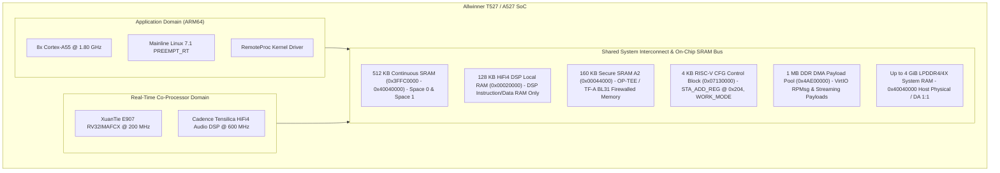
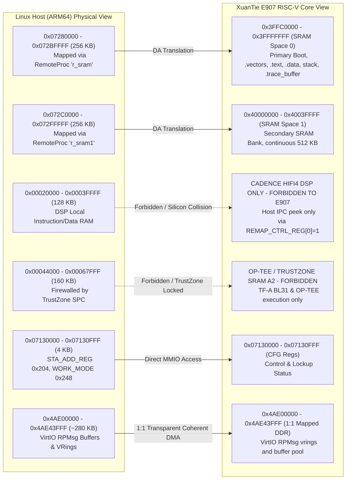
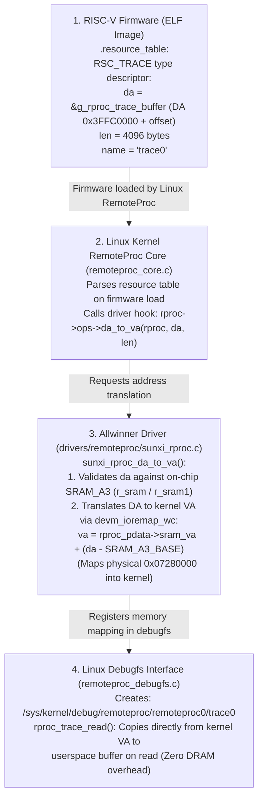
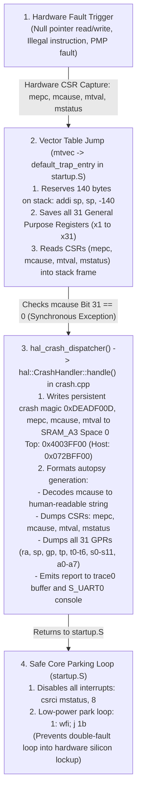

# RISC-V Co-Processor Programming & Bring-up Guide

This guide explains the architecture of the **XuanTie E907 RISC-V co-processor** on the Radxa Cubie A5E (Allwinner T527 / A527 / `sun55i`), detailing its memory interfaces, firmware compilation flow, boot-up sequence, modern C++ HAL modules, inter-processor communication (IPC), and real-time benchmarking tools.

> 📖 **Historical Hardware Archaeology & Driver Origin**:  
> For the complete historical record of how this hardware mapping was discovered—including vendor BSP device tree excerpts (`sun55iw3p1.dtsi`), driver lifecycle analysis (`sunxi_rproc.c`), live silicon register readbacks (`STA_ADD_REG`, `WORK_MODE_REG`), and the exact root-cause of earlier `0x40000000` lockups—refer to [**`RADXA_CUBIE_A5E_LEGACY_DRIVER_AND_HARDWARE_DISCOVERY.md`**](../platforms/RADXA_CUBIE_A5E_LEGACY_DRIVER_AND_HARDWARE_DISCOVERY.md).

---

## 1. Co-Processor Architecture Overview

The Allwinner T527 SoC integrates a **T-Head XuanTie E907** as its real-time auxiliary co-processor. It is a high-determinism, low-power 32-bit RISC-V processor designed to handle time-critical attitude estimation, sensor filtering, and low-jitter motor control loops, completely isolated from the Linux OS domain running on the 8× ARM Cortex-A55 cores.


```mermaid
flowchart TB
    subgraph SoC["Allwinner T527 / A527 SoC"]
        subgraph AppDomain["Application Domain (ARM64)"]
            A1["8x Cortex-A55 @ 1.80 GHz"]
            A2["Mainline Linux 7.1 PREEMPT_RT"]
            A3["RemoteProc Kernel Driver"]
        end

        subgraph RprocDomain["Real-Time Co-Processor Domain"]
            R1["XuanTie E907 RV32IMAFCX @ 200 MHz"]
            R2["Cadence Tensilica HiFi4 Audio DSP @ 600 MHz"]
        end

        subgraph Interconnect["Shared System Interconnect & On-Chip SRAM Bus"]
            M1["512 KB Continuous SRAM (0x3FFC0000 - 0x40040000) - Space 0 & Space 1"]
            M2["128 KB HiFi4 DSP Local RAM (0x00020000) - DSP Instruction/Data RAM Only"]
            M3["160 KB Secure SRAM A2 (0x00044000) - OP-TEE / TF-A BL31 Firewalled Memory"]
            M4["4 KB RISC-V CFG Control Block (0x07130000) - STA_ADD_REG @ 0x204, WORK_MODE"]
            M5["1 MB DDR DMA Payload Pool (0x4AE00000) - VirtIO RPMsg & Streaming Payloads"]
            M6["Up to 4 GiB LPDDR4/4X System RAM - 0x40040000 Host Physical / DA 1:1"]
        end

        AppDomain --> Interconnect
        RprocDomain --> Interconnect
    end
```

### Hardware Specifications
* **Clock Speed:** Operates at **up to 200 MHz** (managed by `mcu_ccu` @ `0x07102000`). *(Note: The companion Cadence Tensilica HiFi4 Audio DSP operates at 600 MHz).*
* **Core Nomenclature:** **Alibaba T-Head XuanTie E907** RV32IMAFCX core. Instantiated in Allwinner silicon under the legacy IP block name `e906-cfg` (Hardware Version 1.0 @ `0x07130000` = `0x00010000`).
* **Verified Silicon ISA Profile (`MISA = 0x40901125`):**
  - **I**: 32 standard 32-bit General Purpose Registers (`x0`–`x31`).
  - **M**: Hardware Integer Multiplication and Division.
  - **A**: Atomic Memory Operations (`lr.w`, `sc.w`, `amo*`).
  - **F**: **Hardware Single-Precision IEEE-754 Floating Point Unit** (`f0`–`f31` 32-bit float registers).
  - **D (Double-Precision)**: **Not implemented in silicon** (Bit 3 of `MISA` is hardwired to 0). Double-precision operations (`double`) are automatically handled via software emulation routines in `libgcc`.
  - **C**: Compressed 16-bit instructions for high code density.
  - **U**: User privilege mode support.
  - **X**: XuanTie custom vendor instruction extensions.
  - **_zicsr & _zifencei**: Standard CSR manipulation and instruction fence operations.
* **On-Chip Fast Memory Architecture (512 KB Continuous SRAM & 1:1 DDR):** 
  - **SRAM Space 0 (`0x3FFC0000` Core, `0x07280000` Host, 256 KB)**: Primary zero-wait-state on-chip execution pool (`.vectors`, `.text`, `.rodata`, `.data`, `.bss`, `.stack`, `.trace_buffer`). Hardcoded silicon factory reset vector in `STA_ADD_REG` is **`0x3FFC0000`**.
  - **SRAM Space 1 (`0x40000000` Core, `0x072C0000` Host, 256 KB)**: Secondary zero-wait-state on-chip SRAM bank.
  - **Continuous 512 KB SRAM**: From the core's perspective, `0x3FFC0000` to `0x40040000` is one contiguous 512 KB zero-wait SRAM block directly abutting DDR.
  - **DDR DRAM 1:1 Carveout (`0x40040000`+)**: 1:1 transparent mapping with host Linux physical address space. Used for VirtIO RPMsg buffers (`rv_vdev0buffer` @ `0x4AE00000`), vrings (`rv_vdev0vring0` @ `0x4AE40000`, `rv_vdev0vring1` @ `0x4AE42000`), and streaming DMA.
* **Toolchain / ABI:** Target `-march=rv32imafc_zicsr_zifencei -mabi=ilp32` (or `-mabi=ilp32f` for hardware float parameter passing) `-mcmodel=medany`.

---

## 2. Verified Memory Map of XuanTie E907 on Allwinner T527 / A523

### 2.1 E907 Memory Map (SRAM Pools & DDR Carveouts)

The E907 executes out of on-chip SRAM pools and dedicated DDR carveouts:

| Memory Region | Linux Host (ARM64) Physical Address | E907 RISC-V Core Address (DA) | Size | Latency & Usage |
| :--- | :--- | :--- | :--- | :--- |
| **SRAM Space 0 (`r_sram`)** | **`0x07280000`** | **`0x3FFC0000`** | **256 KB** | **Primary Boot & Execution Pool** (`.vectors`, `.text`, `.data`, `.stack`, `.trace_buffer`). Hardcoded hardware reset entry vector. Zero wait states. |
| **SRAM Space 1 (`r_sram1`)** | **`0x072C0000`** | **`0x40000000`** | **256 KB** | **Secondary High-Speed SRAM Bank**. Shared IPC/buffers, stack extension. Zero wait states. |
| **DRAM Space** | **`0x40040000`** | **`0x40040000`** | **~1023 MB** | **1:1 Transparent Mapped DDR** (VirtIO split vrings @ `0x4AE40000`/`0x4AE42000`, packet buffers @ `0x4AE00000`). |
| **RISC-V CFG Control Block** | **`0x07130000`** | **`0x07130000`** | **4 KB** | Hardware control registers: `0x0000` (`VER_REG` = 0x00010000 v1.0), `0x0204` (`STA_ADD_REG` Boot vector defaults to `0x3FFC0000`), `0x0248` (`WORK_MODE_REG`) |

> [!IMPORTANT]
> ### TRACE BUFFER SILICON LOCATION: STRICTLY ON-CHIP SRAM, NEVER DDR
> The RemoteProc trace buffer (`g_rproc_trace_buffer[4096]`, exposed to userspace as `/sys/kernel/debug/remoteproc/remoteproc0/trace0`) **must reside exclusively in on-chip SRAM (`SRAM_A3`)**, placed into the `.trace_buffer` section (`0x3FFC0000` in `e907_sram.ld` or `0x40040000` in `e907_ddr.ld`):
> 1. **Early Boot & Determinism**: The E907 logs boot vectors, clock status, and peripheral bring-up immediately upon reset—long before DDR is initialized, or even when DDR is powered down in low-power sleep.
> 2. **Zero Wait States**: On-chip SRAM guarantees single-cycle logging latency without DRAM bus contention, page misses, or memory refresh stalls.
> 3. **Crash Survivability**: When a fatal exception or illegal instruction trap occurs (`testCrash`), crash register dumps (`mepc`, `mcause`, `sp`) are safely preserved into SRAM even if the DDR controller has locked up or crashed.
> 4. **Host Read Access**: Linux `sunxi_rproc.c` maps `r_sram` via `devm_ioremap_wc` (normal non-cacheable memory on ARM64), allowing debugfs `rproc_trace_read()` to perform byte-level reads directly without external aborts.

### 2.2 Silicon Hardware Ownership & Off-Limits Regions (The "PubSRAM" Truth)

> [!IMPORTANT]
> ### HARDWARE TRUTH: CLEARING UP THE "PUBSRAM" CONFUSION ON T527
> Any older documentation, recycled vendor BSP templates, or earlier assumptions labeling `0x00020000` as the E907's "Primary Boot & Execution window" are **dangerously incorrect** for the T527/A527 silicon:
> 1. **`0x00020000` (128 KB) is HiFi4 DSP Memory**: This physical silicon is wired directly to the Cadence HiFi4 DSP as its local Instruction/Data RAM. If the E907 attempts to boot or execute from here, it will collide with the DSP and corrupt DSP audio algorithms. It is NOT used for OP-TEE.
> 2. **`0x00044000` (160 KB) is OP-TEE / TrustZone Memory (`SRAM A2`)**: This memory is locked by the hardware firewall for secure booting, TF-A BL31, and OP-TEE. It is completely separate from the `0x00020000` block.
> 3. **Why the confusing "Shared PubSRAM" label in BSP code?** Allwinner frequently recycles documentation across SoC families (D1, V853, T527). In older chips, that lower address space was shared MCU SRAM. On the T527, it is physically the DSP's local RAM. It is only "shared" in the sense that Bit 0 of `REMAP_CTRL_REG` allows the ARM host to peek into it to send IPC messages to the DSP.
> 4. **The Final Verdict for E907 Firmware**: Erase `0x00020000` from the E907 mental model and linker scripts entirely. E907 `.vectors`, `.text`, `.data`, and `.stack` must live **exclusively** in the on-chip SRAM pools (`0x3FFC0000` Space 0 and `0x40000000` Space 1, forming 512 KB continuous SRAM).

> [!IMPORTANT]
> ### NO ITCM OR DTCM ON E907 (PURE SRAM & DDR ARCHITECTURE)
> 1. **Zero TCM in Silicon**: Unlike older Allwinner chips (e.g. Allwinner D1 / V853) that implemented private tightly-coupled memories at `0x00000000` (ITCM) and `0x00080000` (DTCM), the XuanTie E907 on the T527 / A527 **implements NO ITCM and NO DTCM**. Addresses `0x07110000` and `0x07120000` do not exist in silicon.
> 2. **Hardware Lockup Discovery**: Setting `STA_ADD_REG` to `0x000000BA` causes an immediate bus error on instruction fetch, triggering a double-fault on `mtvec` (also `0x0`) and placing the core into **Hardware Lockup** (`WORK_MODE_REG 0x07130248 = 0x0000000B`, Bit 3 `BIT_LOCK_STA = 1`).
> 3. **Verified Live Boot Addresses**: The hardware silicon reset vector for `STA_ADD_REG` (`0x07130204`) defaults to **`0x3FFC0000`** (SRAM Space 0 base). Setting `STA_ADD_REG` to **`0x3FFC0000`** runs cleanly without lockup (`WORK_MODE_REG = 0x00000003`, Bit 3 `BIT_LOCK_STA = 0`).

### 2.3 Off-Limits Memory Regions & Hardware Traps (Forbidden Memory Zones)

There are four strictly off-limits memory zones that RISC-V firmware and Linux RemoteProc must never touch:

| Forbidden Zone | Address Range | Hardware Owner | Consequence of Access | Protection in Linux Driver (`sunxi_rproc.c`) |
| :--- | :--- | :--- | :--- | :--- |
| **Zone 1: Low Addresses / Fake TCM** | `< 0x00020000` (`0x00000000`–`0x0001FFFF`) | Silicon Mask ROM (BROM) | Hardware lockup (`WORK_MODE_REG` Bit 3 `BIT_LOCK_STA = 1`). No ITCM exists on E907. | Outright rejected with `-EINVAL` in `da_to_va()` |
| **Zone 2: HiFi4 DSP Local RAM** | `0x00020000`–`0x0003FFFF` (128 KB) | Cadence HiFi4 Audio DSP | Bus collision with DSP; corrupts DSP execution. Only accessible to host when `REMAP[0]=1`. | Outright rejected with `-EINVAL` in `da_to_va()` |
| **Zone 3: Secure SRAM A2** | `0x00040000`–`0x00067FFF` (160 KB) | TF-A BL31 / OP-TEE / PSCI | TrustZone / S-BUS security exception; kernel crash or bus lockup | Outright rejected with `-EINVAL` in `da_to_va()` |
| **Zone 4: DSP Local Secondary RAM** | `0x00400000`–`0x0044FFFF` (128 KB) | Cadence HiFi4 Audio DSP | Corrupts DSP audio algorithms; bus collision once DSP takes ownership (`REMAP[0] = 0`) | Outright rejected with `-EINVAL` in `da_to_va()` |

### 2.4 Allwinner On-Chip SRAM Partitioning & Hardware Allocation

| SRAM Bank | Physical Base (Host) | Core Address (E907) | Size | Hardware Owner | Primary Purpose & Usage | Allowed for RISC-V E907? |
| :--- | :--- | :--- | :--- | :--- | :--- | :--- |
| **`BROM`** | `0x00000000` | Unmapped | 128 KB | SoC Hardware | Silicon Mask ROM; executes first instruction on power-on reset | ❌ **No** (BootROM) |
| **`DSP RAM` (`PubSRAM C`)** | `0x00020000` | Unmapped | 128 KB | **Cadence HiFi4 DSP** | **DSP Instruction/Data RAM**. Host IPC peek only via `REMAP_CTRL_REG[0]`. | ❌ **STRICTLY PROHIBITED** (DSP Collision) |
| **`SRAM A2`** | `0x00044000` | Unmapped | 160 KB | **Secure EL3 (TF-A) / OP-TEE** | **Secure World (TF-A BL31, OP-TEE, PSCI 1.1 power management, CPU suspend/hotplug)** | ❌ **STRICTLY PROHIBITED** (TrustZone Firewall) |
| **`SRAM Space 0` (`r_sram`)** | `0x07280000` | `0x3FFC0000` | 256 KB | **XuanTie E907** | **Primary zero-wait-state execution window (`.vectors`, `.text`, `.data`, `.stack`, `.trace_buffer`)**. Factory reset entry vector. | ✅ **YES (Primary E907 Pool)** |
| **`SRAM Space 1` (`r_sram1`)** | `0x072C0000` | `0x40000000` | 256 KB | **XuanTie E907 / Shared** | **Secondary zero-wait-state SRAM bank**. Combined 512 KB continuous SRAM. | ✅ **YES (Secondary E907 Pool)** |
| **`DSP IRAM/DRAM`**| `0x00400000` | Unmapped | 128 KB | **Cadence HiFi4 DSP** | **Private DSP Execution & Audio Buffers** | ❌ **STRICTLY PROHIBITED** (DSP Local RAM) |
| **`CFG Regs`** | `0x07130000` | `0x07130000` | 4 KB | **Host & E907 Control** | Hardware version (`0x00` = 0x00010000), Boot entry vector (`0x204` = 0x3FFC0000), Work Mode / Lockup (`0x248`) | ✅ **YES (Registers Only, Not SRAM)** |
| **`dram_dma`**| `0x40040000`+| `0x40040000`+| 1:1 Mapped | Linux RemoteProc | Transparent 1:1 DDR memory for VirtIO rings (`0x4AE40000`), buffers (`0x4AE00000`), and streaming DMA | ✅ **YES (1:1 DDR Carveout)** |

### 2.5 Control, Peripheral & Inter-Core Registers

| Peripheral Block | Linux Host Physical Address | E907 RISC-V Address | Description & Hardware Usage |
| :--- | :--- | :--- | :--- |
| **Hardware REMAP Register**| **`0x07010364` (A527) / `0x07140364` (T527)**| — | Offset `0x364`: Bit 0 = `MCU_RAM_REMAP` (DSP), Bit 1 = `SRAMA3_2_RAM_REMAP` |
| **MCU CCU Clocks & Resets** | **`0x07102000` / `0x07140000`** | **`0x07102000` / `0x07140000`** | Core clock gate (`CLK_BUS_RV`), bus clock gate (`CLK_BUS_RV_CFG`), resets (`RST_BUS_RV`, `RST_BUS_RV_CFG`, `RST_BUS_RV_DBG`) |
| **RISC-V CFG Controller** | **`0x07130000`** | **`0x07130000`** | Boot entry vector register (`0x07130204`, reset default `0x3FFC0000`), Work Mode & Lockup status register (`0x07130248`) |
| **Hardware MSGBOX (Mailbox)** | **`0x03003000`** | **`0x03003000`** | Hardware doorbell FIFO: **Channel 8** assigned to RISC-V (`e906_rproc`), Channel 4 to DSP |
| **Main PIO (GPIO B–K)** | **`0x02000000`** | **`0x02000000`** | 1:1 mapped GPIO pin control registers |
| **UART0 (Debug Console)** | **`0x02500000`** | **`0x02500000`** | Shared serial console |
| **UART2 (Co-processor Port)** | **`0x02500800`** | **`0x02500800`** | High-speed serial / RC receiver interface |
| **TWI2 (I2C Controller 2)** | **`0x02502800`** | **`0x02502800`** | Dedicated to E907 (`rproc-name = "7130000.e906_rproc"`) for camera sensor 0 |
| **TWI3 (I2C Controller 3)** | **`0x02502C00`** | **`0x02502C00`** | Dedicated to E907 (`rproc-name = "7130000.e906_rproc"`) for camera sensor 1 |

### 2.6 Visual Address Translation Architecture


```mermaid
flowchart LR
    subgraph Host["Linux Host (ARM64) Physical View"]
        H1["0x07280000 - 0x072BFFFF (256 KB)
        Mapped via RemoteProc 'r_sram'"]
        H2["0x072C0000 - 0x072FFFFF (256 KB)
        Mapped via RemoteProc 'r_sram1'"]
        H3["0x00020000 - 0x0003FFFF (128 KB)
        DSP Local Instruction/Data RAM"]
        H4["0x00044000 - 0x00067FFF (160 KB)
        Firewalled by TrustZone SPC"]
        H5["0x07130000 - 0x07130FFF (4 KB)
        STA_ADD_REG 0x204, WORK_MODE 0x248"]
        H6["0x4AE00000 - 0x4AE43FFF (~280 KB)
        VirtIO RPMsg Buffers & VRings"]
    end

    subgraph E907["XuanTie E907 RISC-V Core View"]
        E1["0x3FFC0000 - 0x3FFFFFFF (SRAM Space 0)
        Primary Boot, .vectors, .text, .data, stack, .trace_buffer"]
        E2["0x40000000 - 0x4003FFFF (SRAM Space 1)
        Secondary SRAM Bank, continuous 512 KB"]
        E3["CADENCE HIFI4 DSP ONLY - FORBIDDEN TO E907
        Host IPC peek only via REMAP_CTRL_REG[0]=1"]
        E4["OP-TEE / TRUSTZONE SRAM A2 - FORBIDDEN
        TF-A BL31 & OP-TEE execution only"]
        E5["0x07130000 - 0x07130FFF (CFG Regs)
        Control & Lockup Status"]
        E6["0x4AE00000 - 0x4AE43FFF (1:1 Mapped DDR)
        VirtIO RPMsg vrings and buffer pool"]
    end

    H1 -->|"DA Translation"| E1
    H2 -->|"DA Translation"| E2
    H3 -.->|"Forbidden / Silicon Collision"| E3
    H4 -.->|"Forbidden / TrustZone Locked"| E4
    H5 -->|"Direct MMIO Access"| E5
    H6 -->|"1:1 Transparent Coherent DMA"| E6
```

### 2.7 How Linux RemoteProc Routes Firmware ELFs

When Linux RemoteProc loads a firmware ELF:
1. **Dedicated SRAM Space 0 (`0x3FFC0000`)**:
   Core Device Address `0x3FFC0000` is translated by `sunxi_rproc_da_to_va()` directly into `priv->r_sram_va` (host physical `0x07280000`). This is where all `.vectors`, `.text`, `.rodata`, `.data`, `.bss`, `.stack`, and `.trace_buffer` reside.
2. **Dedicated SRAM Space 1 (`0x40000000`)**:
   Core Device Address `0x40000000` is translated directly into `priv->r_sram1_va` (host physical `0x072C0000`). Together with Space 0, this forms the continuous 512 KB zero-wait SRAM bank.
3. **Hard Error Guards for Forbidden Memory**:
   `sunxi_rproc_da_to_va()` rejects any attempt to load into `< 0x00020000` (BROM/fake TCM), `0x00020000`–`0x0003FFFF` (HiFi4 DSP memory), `0x00040000`–`0x00067FFF` (OP-TEE SRAM A2), or `0x00400000`–`0x0044FFFF` (DSP secondary RAM).
4. **RISC-V CFG Controller (`0x07130000`)**:
   Hardware control registers (not writable SRAM). On start, the driver writes the ELF entry point (`0x3FFC0000`) to `STA_ADD_REG` (`0x07130204`). Core status and lockup can be checked at `WORK_MODE_REG` (`0x07130248`).
5. **DDR Streaming DMA Carveout (`0x40040000`+)**:
   Directly mapped into kernel virtual address space and accessed via non-cached DMA coherent mappings. Reserved strictly for bulk streaming payload transfers and VirtIO rings. Control blocks, descriptors, and trace buffers (`trace0`) reside in deterministic on-chip SRAM.

### 2.8 Hardware Remap Architecture in Device Tree & Linux Driver

#### 1. Hardware Register & Bit Definitions
On the Allwinner T527 and A523/A527, `REMAP_CTRL_REG` controls memory bridge routing between the ARM host interconnect and the `MCU_SYS` co-processor domain:
- **T527 (`sun60iw1`)**: Located in `DSP_CCU` @ `0x07140000` + Offset `0x364` = **`0x07140364`**
- **A523 / A527 (`sun55iw3`)**: Located in `PRCM / R_CCU` @ `0x07010000` + Offset `0x364` = **`0x07010364`**

| Bit Field | Name | Reset | Hardware Meaning & Routing |
| :--- | :--- | :--- | :--- |
| **Bit 0** | `MCU_RAM_REMAP` | `0` | **`0`**: DSP local memory (`0x00020000` and `0x00400000`–`0x0044FFFF`) is private and exclusive to the Cadence HiFi4 DSP.<br>**`1`**: DSP memory window is visible to CPUX to exchange IPC messages with the DSP.<br>*(E907 driver leaves Bit 0 as `0` to prevent any DSP collisions).* |
| **Bit 1** | `SRAMA3_2_RAM_REMAP` | `0` | **`0`**: `SRAMA3_2` is not bridged for `MCU_SYS`.<br>**`1`**: `SRAMA3_2` (`0x07280000` / `0x072c0000`) is bridged into `MCU_SYS`, appearing at core DA **`0x40040000`**. |

#### 2. Device Tree Node Definition (`sun55i-a523.dtsi`)
The clean Device Tree node connects the remoteproc driver exclusively to E907 resources (no DSP memory or PUBSRAM clocks/resets):

```dts
rproc: remoteproc@7130000 {
	compatible = "allwinner,sun55i-a523-rproc",
	             "allwinner,sun55i-a527-rproc";
	reg = <0x07130000 0x1000>,      /* "cfg": E907 CFG & boot-address registers */
	      <0x07280000 0x40000>,     /* "r_sram": SRAM_A3 Space 0 (256 KB on A523, 512 KB on T527) */
	      <0x072c0000 0x40000>,     /* "r_sram1": SRAM_A3 Space 1 (256 KB on A523, 512 KB on T527) */
	      <0x07010364 0x4>;         /* "remap": REMAP_CTRL_REG (0x07010364 on A523, 0x07140364 on T527) */
	reg-names = "cfg", "r_sram", "r_sram1", "remap";
	clocks = <&mcu_ccu CLK_BUS_MCU_RISCV_CFG>,
	         <&mcu_ccu CLK_MCU_RISCV>;
	clock-names = "bus", "core";
	resets = <&mcu_ccu RST_BUS_MCU_RISCV_CFG>,
	         <&mcu_ccu RST_BUS_MCU_RISCV_CORE>;
	reset-names = "cfg", "core";
	mboxes = <&msgbox 0>, <&msgbox 1>;
	mbox-names = "rx", "tx";
	status = "disabled";
};
```

#### 3. RemoteProc Driver Lifecycle (`sunxi_rproc.c`)
- **Probe (`sunxi_rproc_register_mem`)**: Maps `"r_sram"` (`0x07280000`), `"r_sram1"` (`0x072c0000`), and `"remap"` (`0x07010364`).
- **Prepare (`sunxi_rproc_prepare`)**: Sets Bit 1 of `REMAP_CTRL_REG` (`val |= BIT(1)`), exposing `SRAMA3_2` to `MCU_SYS`. Bit 0 is left untouched.
- **DA Translation (`sunxi_rproc_da_to_va`)**: Translates `0x3FFC0000`–`0x3FFFFFFF` to `priv->r_sram_va` (`0x07280000`) and `0x40000000`–`0x4003FFFF` to `priv->r_sram1_va` (`0x072C0000`). Rejects forbidden regions (`< 0x00020000`, `0x00020000`–`0x0003FFFF`, `0x00040000`–`0x00067FFF`, and `0x00400000`–`0x0044FFFF`).
- **Unprepare (`sunxi_rproc_unprepare`)**: Symmetrically clears Bit 1 of `REMAP_CTRL_REG` on core shutdown.

---

## 3. Firmware Layout, Linker Scripts & Bootstrap Sequence

### Production Linker Scripts (`riscv-firmware/common/arch_riscv/`)

Three specialized linker scripts cover all deployment and simulation targets:

1. **`e907_sram.ld` (Default - Pure SRAM)**:
   Places all execution code, data, stack, trace buffer, and shared structures into verified **SRAM Space 0 (`0x3FFC0000`, 256 KB)**:

```ld
OUTPUT_ARCH("riscv")
ENTRY(_vectors)

MEMORY
{
    SRAM (rwx) : ORIGIN = 0x3FFC0000, LENGTH = 256K
}

SECTIONS
{
    /* Exception vector table must be 64-byte aligned for RISC-V mtvec */
    .vectors :
    {
        . = ALIGN(64);
        KEEP(*(.vectors))
        KEEP(*(.text.startup))
    } > SRAM

    .text :
    {
        . = ALIGN(4);
        *(.text)
        *(.text.*)
        *(.fastcode)
        *(.fastcode.*)
        . = ALIGN(4);
    } > SRAM_A3

    .rodata :
    {
        . = ALIGN(4);
        *(.rodata)
        *(.rodata.*)
        *(.srodata)
        *(.srodata.*)
        . = ALIGN(4);
    } > SRAM_A3

    /* RemoteProc Resource Table (Parsed by Linux on ELF Load) */
    .resource_table :
    {
        . = ALIGN(4);
        KEEP(*(.resource_table))
        KEEP(*(.resource_table*))
        . = ALIGN(4);
    } > SRAM_A3

    .data :
    {
        . = ALIGN(4);
        _sdata = .;
        PROVIDE(__global_pointer$ = . + 0x800);
        *(.data)
        *(.data.*)
        *(.sdata)
        *(.sdata.*)
        . = ALIGN(4);
        _edata = .;
    } > SRAM_A3
    _sidata = LOADADDR(.data);

    .bss :
    {
        . = ALIGN(4);
        _sbss = .;
        *(.bss)
        *(.bss.*)
        *(.sbss)
        *(.sbss.*)
        *(COMMON)
        . = ALIGN(4);
        _ebss = .;
    } > SRAM_A3

    /* Execution Stack (8 KB) */
    .stack (NOLOAD) :
    {
        . = ALIGN(16);
        _stack_bottom = .;
        . += 0x2000;
        _stack_top = .;
    } > SRAM_A3

    /* Scratchpad Memory */
    .dtcm_scratch (NOLOAD) :
    {
        . = ALIGN(4);
        __dtcm_scratch_start = .;
        *(.dtcm_scratch)
        *(.dtcm_scratch.*)
        . = ALIGN(4);
        __dtcm_scratch_end = .;
    } > SRAM_A3

    /* RemoteProc Trace Buffer */
    .trace_buffer (NOLOAD) :
    {
        . = ALIGN(4);
        __trace_start = .;
        KEEP(*(.trace_buffer))
        KEEP(*(.trace_buffer.*))
        . = ALIGN(4);
        __trace_end = .;
    } > SRAM_A3

    /* Shared Application / IPC Memory */
    .sram_c (NOLOAD) :
    {
        . = ALIGN(4);
        __sram_c_start = .;
        *(.sram_c)
        *(.sram_c.*)
        *(.sram_c_loc1)
        *(.sram_c_loc2)
        . = ALIGN(4);
        __sram_c_end = .;
    } > SRAM_A3
}
```

2. **`e907_ddr.ld` (Multi-Bank SRAM + DDR)**:
   Places fast code (`.fastcode`) and critical stack in zero-wait-state `SRAM_FAST` (`0x3FFC0000`), resource tables and IPC structures in `SRAM_A3_2` (`0x40000000`), and large VirtIO packet pools in non-cacheable DDR (`0x48100000`).

3. **`qemu.ld` (QEMU virt Emulation)**:
   Places all code, data, and stack in QEMU virt machine DRAM (`0x80000000`, 128 MB) with `_start` aligned at the base of memory.

Build selection is controlled directly via `common.mk`:
```bash
# Default build (SRAM Space 0 0x3FFC0000)
make

# Multi-Bank SRAM + DDR build
make MEM=ddr

# QEMU Emulation build
make MEM=qemu
# or shortcut:
make QEMU=1

# Run local QEMU simulation with GDB stub:
make qemu
# In another terminal, connect GDB:
make gdb
```

### Bootstrap Sequence (`riscv-firmware/common/arch_riscv/startup.S`)

1. **Configure Trap Vector**: `la t0, default_trap_entry`, `csrw mtvec, t0` (aligned to 64 bytes in SRAM `0x3FFC0000`) before any other instruction can fault.
2. **Disable Interrupts**: `csrw mie, zero` (mie only; mip is read-only status).
3. **Diagnostic Signature**: Writes `0xDEADBEEF` directly to SRAM `__sram_c_start` to prove assembly execution immediately upon reset deassertion.
4. **Setup Stack Pointer**: `la sp, _stack_top` in SRAM (16 KB dedicated stack, strictly 16-byte aligned per RISC-V ABI).
5. **Setup Global Pointer**: `la gp, __global_pointer$` for relaxed linker addressing.
6. **Enable Hardware FPU**:
   ```assembly
   li t0, (1 << 13) | (1 << 14)
   csrs mstatus, t0              /* Set mstatus.FS = 0b11 (Dirty / Initial) */
   csrw fcsr, zero               /* Clear accrued exceptions and set RNE mode */
   ```
   > [!IMPORTANT]
   > At hardware reset, `mstatus.FS` is `00` (**Off**). Attempting to execute any floating-point instruction (`flw`, `fsw`, `fadd.s`, `fmul.s`) or access `fcsr` while `FS == 00` immediately causes an **Illegal Instruction Exception** (`mcause = 2`). Setting `FS = 0b11` enables the hardware Single-Precision FPU.
7. **Copy Initialized Data**: Copies `.data` from Flash/LMA to SRAM VMA if separate.
8. **Zero BSS**: Clears `.bss` variables in SRAM.
9. **Call Global C++ Constructors**: Calls `__libc_init_array` if static constructors exist.
10. **Jump to Application**: Executes `call main`.

#### Trap Stack & Interrupt Architecture Policy
* **Trap Frame Allocation**: `default_trap_entry` allocates **144 bytes** on the stack ($144 = 9 \times 16$ bytes, maintaining strict 16-byte ABI alignment). It preserves 31 General Purpose Registers (`x1`–`x31`) and 4 Machine CSRs (`mepc`, `mcause`, `mtval`, `mstatus`).
* **Floating-Point Registers on Stack**: 
  - In our high-performance bare-metal firmware (non-RTOS), **Interrupt Service Routines (ISRs) are kept integer-only by design**.
  - Because ISRs do not execute floating-point operations, the core does not need to push and pop all 32 float registers (`f0`–`f31`) and `fcsr` on every interrupt. This saves over 33 memory instructions per trap, delivering sub-microsecond IRQ response times.
  - If a preemptive multi-threaded RTOS (e.g. FreeRTOS) is deployed in the future, task context switching code can conditionally save `f0`–`f31` on the task stack when `mstatus.FS == Dirty`.

---

## 4. Modern Zero-Allocation C++ HAL Modules (`common/hal/`)

The firmware architecture uses a modular, zero-allocation C++ HAL suite located under [`riscv-firmware/common/hal/`](/riscv-firmware/common/hal/):

* **`hal::Rpmsg` (`hal/rpmsg.hpp`, `hal/rpmsg.cpp`)**:
  - Zero-allocation VirtIO vring and OpenAMP RPMsg driver.
  - Implements VirtIO split vrings, descriptor tables, available/used rings, and Name Service Announcements.
  - Interoperates cleanly with Linux kernel `virtio_rpmsg_bus` and `rpmsg_char`.
* **`hal::SpscQueue` (`hal/spsc_queue.hpp`)**:
  - Lock-free, zero-allocation Single-Producer Single-Consumer circular ring buffer.
  - Utilizes C++11 atomic acquire-release memory fences for synchronization between ARM64 Linux and RISC-V E907 in shared SRAM without locking.
* **`hal::Pmp` (`hal/pmp.hpp`, `hal/pmp.cpp`)**:
  - Configures XuanTie E907 Physical Memory Protection (PMP) CSRs (`pmpaddr*`, `pmpcfg*`).
  - Marks external DDR DMA payload buffers (`0x48100000`) as non-cacheable to eliminate cache invalidation/flush overhead.
* **`hal::Trace` (`hal/trace.hpp`)**:
  - Zero-allocation ASCII string and packed binary ring-buffer logger.
  - Formats telemetry, heartbeats, and sensor readings directly into the RemoteProc debugfs `trace0` buffer.
* **`hal::Crash` (`hal/crash.hpp`)**:
  - Machine-mode exception and trap autopsy handler.
  - Captures all 31 GPRs (`x1`–`x31`) and CSRs (`mepc`, `mcause`, `mtval`, `mstatus`) upon fatal faults, outputting structured crash logs to `trace0` and writing `0xDEADF00D` to SRAM (`0x3FFFFF00`).
* **`hal::Timer` (`hal/timer.hpp`)**:
  - Calibrated 64-bit microsecond counter and busy-wait delay for the 200 MHz core (`TICKS_PER_US = 200`).

---

## 5. Test Applications Suite (`apps/`)

Under [`riscv-firmware/apps/`](/riscv-firmware/apps/), seven progressive test applications validate core functionality, memory mapping, telemetry, exception handling, and three inter-processor communication paradigms:

```text
apps/
├── testBasic/               # Minimal boot, SRAM execution, and live counter increments
├── testStringBinaryTrace0/  # Combined ASCII text + packed binary telemetry with hardware FPU
├── testCrash/               # Hardware exception trapping (mtvec) & full register crash dump
├── testPing/                # Fast, low-jitter Direct Shared Memory (hal::SpscQueue) + Linux benchmark
│   └── linux/               # ping_shm Linux host companion benchmark tool
├── testPingRpmsg/           # Standard Linux VirtIO RPMsg (hal::Rpmsg) echo firmware + Linux benchmark
│   └── linux/               # ping_rpmsg Linux host companion benchmark tool
└── testDRAMMsg/             # Hybrid SRAM SPSC Queue + DDR DRAM Payload Buffers + PMP non-cacheable
    └── linux/               # ping_dram Linux host companion benchmark tool
```

### Application Details

1. **`testBasic`**: Boots into SRAM Space 0 `0x3FFC0000` and continuously writes magic counters to SRAM (`0x3FFC1000`, `0x3FFC1004`) for sanity testing.
2. **`testStringBinaryTrace0`**: Registers a `.resource_table` with a 4 KB `trace0` buffer in SRAM. Combines double-precision hardware FPU math (sine wave computation) with a 36-byte packed binary `TelemetryPacket` in SRAM (`0x3FFC1000`) and formatted ASCII log output in `trace0`.
   > **Note on `epoll` & Polling**: Upstream Linux debugfs `trace0` (`drivers/remoteproc/remoteproc_debugfs.c`) does **not** implement `.poll` or attach a wait queue; calling `epoll_ctl()` returns `EPERM`. Thus, companion scripts (`monitor_trace.py`) poll in a loop. Hardware Mailbox doorbells and `/dev/rpmsg0` provide event-driven notifications with full `epoll` support for 0% host CPU wait.
3. **`testCrash`**: Verifies machine-mode exception trapping (`mtvec`). After emitting heartbeats, it executes an illegal instruction, triggering a full register autopsy dump to `trace0` and writing `0xDEADF00D` to SRAM (`0x3FFFFF00`).
4. **`testPing`**: Ultra-low-latency direct shared SRAM SPSC communication using `hal::SpscQueue`. Linux companion tool `ping_shm` measures round-trip time latency down to ~1.5–2.5 $\mu\text{s}$.
5. **`testPingRpmsg`**: Standard Linux kernel VirtIO RPMsg framework (`virtio_rpmsg_bus`) using `hal::Rpmsg`. Interacts with `/dev/rpmsg0` via companion tool `ping_rpmsg`.
6. **`testDRAMMsg`**: Hybrid memory architecture combining zero-wait-state SRAM SPSC control queues with a 1 MB DDR DRAM payload buffer pool (`0x48100000`) configured as non-cacheable via `hal::Pmp`. Linux companion tool `ping_dram` benchmarks high-bandwidth payload transfers up to 4 KB per frame.

---

## 6. Communication Paradigm & IPC Architecture Comparison

| IPC Category | **[STANDARDS-BASED]**<br>Official `libopenamp` + `libmetal` | **[STANDARDS-BASED]**<br>Lite-libmetal / `hal::Rpmsg` (`testPingRpmsg`) | **[CUSTOM LOW-LATENCY]**<br>Hybrid SRAM / DDR (`testDRAMMsg`) | **[CUSTOM LOW-LATENCY]**<br>Pure Dedicated SRAM (`testPing` / `hal::SpscQueue`) |
| :--- | :--- | :--- | :--- | :--- |
| **Architecture Family** | **Standards-Based (VirtIO / OpenAMP)** | **Standards-Based (VirtIO / OpenAMP)** | **Custom Hardware-Direct HAL** | **Custom Hardware-Direct HAL** |
| **Control Path** | VirtIO vrings via `libmetal` layers | VirtIO vrings via C++ `std::atomic` | Lock-Free SPSC in SRAM (`0x3FFC0000` / `0x40000000`) | Lock-Free SPSC in SRAM (`0x3FFC0000` / `0x40000000`) |
| **Data Path** | RPMsg DMA buffers (DDR) | RPMsg DMA buffers (DDR) | **DDR DRAM Carveout (`0x48100000`, 1 MB)** | Direct SRAM (`0x3FFC0000` / `0x40000000`, 64B frames) |
| **Linux Driver / Stack**| `virtio_rpmsg_bus` + `rpmsg_char` | `virtio_rpmsg_bus` + `rpmsg_char` | Kernel UIO / Reserved Memory Carveout | Kernel UIO / Shared SRAM (`sunxi_rproc`) |
| **Linux Ecosystem**     | Standard (`/dev/rpmsg0`, `/dev/ttyRPMSG0`) | Standard (`/dev/rpmsg0`, `/dev/ttyRPMSG0`) | Custom High-Speed API / `ping_dram` | Custom High-Speed API / `ping_shm` |
| **Firmware Code Size**  | **~30 – 50 KB** (requires dynamic heap) | **~2 – 3 KB** (zero dynamic allocation) | **~3 – 4 KB** (zero dynamic allocation) | **< 1 KB** (header-only C++ template) |
| **Typical RTT Latency** | **~60 – 160 $\mu\text{s}$** | **~50 – 90 $\mu\text{s}$** | **~3.0 – 6.0 $\mu\text{s}$** (DDR bus latency) | **~1.5 – 2.5 $\mu\text{s}$** (Zero-wait-state SRAM) |
| **Jitter (StdDev)**     | Moderate (Kernel context switches) | Moderate (Kernel context switches) | **Ultra-Low (<0.5 $\mu\text{s}$)** | **Ultra-Low (<0.2 $\mu\text{s}$)** |
| **Max Payload Size**    | Medium (512 B default) | Medium (512 B default) | **Large (Up to 4 KB per frame, MBs pool)** | Small (40–64 B, SRAM capacity bounded) |
| **Throughput Bandwidth**| Moderate (~10–20 MB/s) | Moderate (~10–20 MB/s) | **High Bandwidth (>100 MB/s)** | High Packet Rate (Low Payload) |
| **Target Use Case**     | Generic standard OS interop | Lightweight standard Linux RPMsg | Point-clouds, camera frames, flight logs | Hard real-time motor control, PID loops |

---

## 7. How to Build & Deploy on Target (Cubie A5E)

### 7.1 Build Everything (Firmware + Linux Benchmark Tools)

From the top-level repository or `riscv-firmware/` directory:

```bash
make -C riscv-firmware
```

All compiled firmware ELFs are staged into `riscv-firmware/bin/` with distinct names:
* `testBasic.elf`
* `testStringBinaryTrace0.elf`
* `testCrash.elf`
* `testPing.elf`
* `testPingRpmsg.elf`
* `testDRAMMsg.elf`

Linux benchmark tools are also compiled and staged:
* `ping_shm` (Direct Shared Memory SPSC benchmark)
* `ping_rpmsg` (VirtIO RPMsg benchmark)
* `ping_dram` (Hybrid SRAM/DRAM benchmark)

During the Buildroot rootfs build, these firmware ELFs are automatically installed to `/lib/firmware/` and the companion tools to `/usr/local/bin/`.

---

### 7.2 Live Firmware Switching on Target (Cubie A5E)

The Linux RemoteProc framework allows stopping, switching, and starting firmware dynamically at runtime without rebooting:

```bash
# ==============================================================================
# 1. Run Pure Shared SRAM Ping (testPing)
# ==============================================================================
echo stop > /sys/class/remoteproc/remoteproc0/state
echo "testPing.elf" > /sys/class/remoteproc/remoteproc0/firmware
echo start > /sys/class/remoteproc/remoteproc0/state

# Run high-frequency latency benchmark (e.g., 50,000 round-trips over SRAM 0x3FFC0000)
ping_shm -n 50000

# ==============================================================================
# 2. Run Hybrid SRAM/DRAM SPSC Benchmark (testDRAMMsg)
# ==============================================================================
echo stop > /sys/class/remoteproc/remoteproc0/state
echo "testDRAMMsg.elf" > /sys/class/remoteproc/remoteproc0/firmware
echo start > /sys/class/remoteproc/remoteproc0/state

# Run streaming DRAM payload benchmark (e.g., 10,000 packets of 1024 bytes)
ping_dram -n 10000 -s 1024

# ==============================================================================
# 3. Run Standard Linux RPMsg (testPingRpmsg)
# ==============================================================================
echo stop > /sys/class/remoteproc/remoteproc0/state
echo "testPingRpmsg.elf" > /sys/class/remoteproc/remoteproc0/firmware
echo start > /sys/class/remoteproc/remoteproc0/state

# Run kernel RPMsg character device benchmark (e.g., 5,000 round-trips)
ping_rpmsg -n 5000
```

---

### 7.3 RemoteProc Debugfs: Architecture, Mounting & Log Streaming

The Linux RemoteProc framework uses the kernel's `debugfs` virtual filesystem to expose low-level diagnostics, crash logs, and recovery controls for the XuanTie E907 co-processor.

#### 1. Mounting Debugfs in Linux
On Buildroot or standard Linux distributions, `debugfs` can be mounted dynamically or configured to mount automatically at boot:

```bash
# Check if debugfs is already mounted
mount | grep -i debugfs

# Mount debugfs manually if not mounted:
mount -t debugfs none /sys/kernel/debug

# Or add to /etc/fstab for automatic mounting on every boot:
# debugfs  /sys/kernel/debug  debugfs  defaults  0  0
```

> [!NOTE]
> **Kernel Configuration Prerequisites**:
> Both `CONFIG_DEBUG_FS=y` and `CONFIG_REMOTEPROC=y` must be enabled in the Linux kernel configuration (`cubie_a5e_defconfig`).

#### 2. RemoteProc Debugfs Directory Structure
Once debugfs is mounted and `sunxi_rproc` initializes the co-processor, the driver exposes a dedicated debug hierarchy at `/sys/kernel/debug/remoteproc/remoteproc0/`:

| Debugfs File | Permissions | Function & Usage |
| :--- | :--- | :--- |
| **`trace0`** | `r--r--r--` (Read-only) | Direct byte stream of the on-chip SRAM trace buffer declared in the ELF `.resource_table`. |
| **`recovery`** | `rw-r--r--` (Read/Write) | Controls auto-restart behavior upon crash/watchdog: `enabled` (default) or `disabled`. |
| **`version`** | `r--r--r--` (Read-only) | Displays the Linux RemoteProc subsystem version string. |
| **`coredump`** | `rw-r--r--` (Read/Write) | Configures remoteproc coredump capture mode: `default`, `inline`, or `disabled`. |

#### 3. How Linux RemoteProc Maps `trace0` to On-Chip SRAM
The connection between the RISC-V firmware's `hal::Trace` and Linux userspace `cat /sys/kernel/debug/remoteproc/remoteproc0/trace0` operates entirely through on-chip SRAM via the ELF resource table:


```mermaid
flowchart TD
    FW["1. RISC-V Firmware (ELF Image)
    .resource_table:
    RSC_TRACE type descriptor:
    da = &g_rproc_trace_buffer (DA 0x3FFC0000 + offset)
    len = 4096 bytes
    name = 'trace0'"]

    RPROC_CORE["2. Linux Kernel RemoteProc Core (remoteproc_core.c)
    Parses resource table on firmware load
    Calls driver hook: rproc->ops->da_to_va(rproc, da, len)"]

    SUNXI_DRV["3. Allwinner Driver (drivers/remoteproc/sunxi_rproc.c)
    sunxi_rproc_da_to_va():
    1. Validates da against on-chip SRAM_A3 (r_sram / r_sram1)
    2. Translates DA to kernel VA via devm_ioremap_wc:
       va = rproc_pdata->sram_va + (da - SRAM_A3_BASE)
       (Maps physical 0x07280000 into kernel)"]

    DEBUGFS["4. Linux Debugfs Interface (remoteproc_debugfs.c)
    Creates: /sys/kernel/debug/remoteproc/remoteproc0/trace0
    rproc_trace_read(): Copies directly from kernel VA to
    userspace buffer on read (Zero DRAM overhead)"]

    FW -->|"Firmware loaded by Linux RemoteProc"| RPROC_CORE
    RPROC_CORE -->|"Requests address translation"| SUNXI_DRV
    SUNXI_DRV -->|"Registers memory mapping in debugfs"| DEBUGFS
```

#### 4. Reading and Streaming Trace Logs
Developers can view logs in several ways depending on the workflow:

```bash
# Method A: Direct one-shot read of the entire trace buffer
cat /sys/kernel/debug/remoteproc/remoteproc0/trace0

# Method B: Continuous tail / polling loop (refreshes terminal every second)
while true; do
    clear
    cat /sys/kernel/debug/remoteproc/remoteproc0/trace0
    sleep 1
done

# Method C: Dedicated Python Trace Monitor (incremental stream)
# Installed on target at /usr/local/bin/monitor_trace.py
python3 /usr/local/bin/monitor_trace.py /sys/kernel/debug/remoteproc/remoteproc0/trace0
```

---

### 7.4 Hardware Exception Architecture & HAL Crash Handling

The firmware Hardware Abstraction Layer (`hal`) contains a robust, fail-safe exception handler (`common/hal/crash.cpp` and `common/arch_riscv/startup.S`) designed to prevent silicon lockups and capture post-mortem forensic state.

#### 1. Hardware Exception Pipeline
When an illegal instruction, misaligned access, or memory bus fault occurs on the E907 core:


```mermaid
flowchart TD
    Fault["1. Hardware Fault Trigger
    (Null pointer read/write, Illegal instruction, PMP fault)"]

    Vector["2. Vector Table Jump (mtvec -> default_trap_entry in startup.S)
    1. Reserves 140 bytes on stack: addi sp, sp, -140
    2. Saves all 31 General Purpose Registers (x1 to x31)
    3. Reads CSRs (mepc, mcause, mtval, mstatus) into stack frame"]

    Dispatch["3. hal_crash_dispatcher() -> hal::CrashHandler::handle() in crash.cpp
    1. Writes persistent crash magic 0xDEADF00D, mepc, mcause, mtval to
       SRAM_A3 Space 0 Top: 0x4003FF00 (Host: 0x072BFF00)
    2. Formats autopsy generation:
       - Decodes mcause to human-readable string
       - Dumps CSRs: mepc, mcause, mtval, mstatus
       - Dumps all 31 GPRs (ra, sp, gp, tp, t0-t6, s0-s11, a0-a7)
       - Emits report to trace0 buffer and S_UART0 console"]

    Park["4. Safe Core Parking Loop (startup.S)
    1. Disables all interrupts: csrci mstatus, 8
    2. Low-power park loop: 1: wfi; j 1b
    (Prevents double-fault loop into hardware silicon lockup)"]

    Fault -->|"Hardware CSR Capture: mepc, mcause, mtval, mstatus"| Vector
    Vector -->|"Checks mcause Bit 31 == 0 (Synchronous Exception)"| Dispatch
    Dispatch -->|"Returns to startup.S"| Park
```

#### 2. The `hal::CrashFrame` Structure
The stack layout preserved by `startup.S` corresponds directly to the C++ structure defined in `common/hal/crash.hpp`:

```cpp
namespace hal {

struct CrashFrame {
    uint32_t ra, sp, gp, tp;
    uint32_t t0, t1, t2;
    uint32_t s0, s1;
    uint32_t a0, a1, a2, a3, a4, a5, a6, a7;
    uint32_t s2, s3, s4, s5, s6, s7, s8, s9, s10, s11;
    uint32_t t3, t4, t5, t6;
    uint32_t mepc;
    uint32_t mcause;
    uint32_t mtval;
    uint32_t mstatus;
};

class CrashHandler {
public:
    static void handle(const CrashFrame &frame) noexcept;
    static const char *get_cause_name(uint32_t mcause) noexcept;
};

} // namespace hal
```

#### 3. Persistent Crash Signature in On-Chip SRAM
To ensure forensic data survives even if the trace buffer is partially corrupted or overwritten, `hal::CrashHandler::handle()` writes a 4-word persistent signature to the very top 256 bytes of SRAM Space 0 (`0x3FFFFF00` Core DA):

| Word Offset | Address (RISC-V DA) | Address (Host Physical A527) | Address (Host Physical T527) | Value / Field Description |
| :--- | :--- | :--- | :--- | :--- |
| `Word 0` | `0x3FFFFF00` | `0x072BFF00` | `0x0723FF00` | `0xDEADF00D` (Fatal crash magic identifier) |
| `Word 1` | `0x3FFFFF04` | `0x072BFF04` | `0x0723FF04` | `mepc` (Program counter of faulting instruction) |
| `Word 2` | `0x3FFFFF08` | `0x072BFF08` | `0x0723FF08` | `mcause` (Hardware exception reason code) |
| `Word 3` | `0x3FFFFF0C` | `0x072BFF0C` | `0x0723FF0C` | `mtval` (Faulting memory address or bad opcode) |

> [!IMPORTANT]
> **Why 0x3FFFFF00 and NOT 0x3FFC0000?**
> SRAM Space 0 base (`0x3FFC0000`) is where the RISC-V `.vectors` table and entry point reside. Writing a crash dump signature to `0x3FFC0000` would overwrite the reset and trap vectors, causing subsequent core warm-restarts to fault immediately. Moving the crash signature to `0x3FFFFF00` (the last 256 bytes of the 256 KB slice) ensures both `.vectors` and crash forensics remain completely intact.

---

### 7.5 Step-by-Step Crash Dump Debugging from Linux

This section provides a practical, step-by-step walkthrough for debugging a firmware crash using the included `testCrash.elf` diagnostic application.

#### Step 1: Disable RemoteProc Auto-Recovery
By default, the Linux RemoteProc subsystem attempts to immediately restart the co-processor when a crash or timeout occurs. To inspect the post-mortem registers without the kernel restarting the core:

```bash
# On target Linux shell:
echo disabled > /sys/kernel/debug/remoteproc/remoteproc0/recovery
```

#### Step 2: Trigger the Crash (`testCrash.elf`)
Load and start `testCrash.elf`, which purposefully executes a faulting operation (e.g. invalid memory read):

```bash
echo stop > /sys/class/remoteproc/remoteproc0/state
echo "testCrash.elf" > /sys/class/remoteproc/remoteproc0/firmware
echo start > /sys/class/remoteproc/remoteproc0/state
```

#### Step 3: Inspect the Autopsy Report via Debugfs `trace0`
Read the debugfs trace buffer to obtain the human-readable exception autopsy:

```bash
cat /sys/kernel/debug/remoteproc/remoteproc0/trace0
```

**Expected Autopsy Output:**
```text
################################################################
  FATAL HARDWARE EXCEPTION DETECTED ON XUANTIE E907 RISC-V CORE 
################################################################
  Cause Name : Illegal instruction
  mcause     : 0x00000002
  mepc (PC)  : 0x4000080e
  mtval      : 0x00000000
  mstatus    : 0x00001880

--- General Purpose Register (GPR) Dump ---
  ra (x1) = 0x40000812  sp (x2) = 0x4003fea0  gp (x3) = 0x40008400
  tp (x4) = 0x00000000  t0 (x5) = 0x00000000  t1 (x6) = 0x00000000
  t2 (x7) = 0x00000000  s0 (x8) = 0x00000004  s1 (x9) = 0x00000000
  a0 (x10)= 0x00000064  a1 (x11)= 0x00000000  a2 (x12)= 0x00000000
  a3 (x13)= 0x00000000  a4 (x14)= 0x00000000  a5 (x15)= 0x00000003
  a6 (x16)= 0x00000000  a7 (x17)= 0x00000000  s2 (x18)= 0x00000000
  s3 (x19)= 0x00000000  s4 (x20)= 0x00000000  s5 (x21)= 0x00000000
  s6 (x22)= 0x00000000  s7 (x23)= 0x00000000  s8 (x24)= 0x00000000
  s9 (x25)= 0x00000000  s10(x26)= 0x00000000  s11(x27)= 0x00000000
  t3 (x28)= 0x00000000  t4 (x29)= 0x00000000  t5 (x30)= 0x00000000
  t6 (x31)= 0x00000000
################################################################
  Core halted safely. Inspect /sys/.../trace0 or SRAM_A3 (0x4003FF00)
################################################################
```

#### Step 4: Low-Level Physical Memory Verification (`devmem2`)
If `trace0` is unavailable or truncated, read the raw hardware crash signature directly from physical SRAM using `devmem2`:

```bash
# Host physical address for SRAM_A3 Space 0 is 0x07280000:
# 0x07280000 (r_sram) + 0x0003FF00 = 0x072BFF00
devmem2 0x072BFF00 w 4
```

> [!WARNING]
> ### DO NOT USE `0x07200000` (CAUSES HARDWARE BUS ERROR)
> In some earlier documentation or vendor notes, `0x07200000` was mistakenly referenced. In the actual Sun55i silicon bus architecture and device tree, `0x07200000` is an unmapped AXI address space. Reading or writing `0x07200000` from Linux will trigger an immediate, fatal hardware **Bus error** (external abort). Always use **`0x07280000`**.

**Verification:**
* `0x072BFF00`: `0xDEADF00D` $\rightarrow$ Magic confirmed! A fatal trap occurred.
* `0x072BFF04`: `0x4000080E` $\rightarrow$ `mepc` (Program Counter of faulting instruction).
* `0x072BFF08`: `0x00000002` $\rightarrow$ `mcause` (Illegal instruction exception).
* `0x072BFF0C`: `0x00000000` $\rightarrow$ `mtval` (Faulting opcode: `0x00000000`).

#### Step 5: Pinpoint the Exact C/C++ Source Line (`addr2line`)
On your host development machine (or target with GNU toolchain installed), use `riscv-none-elf-addr2line` with the `mepc` address:

```bash
riscv-none-elf-addr2line -e riscv-firmware/bin/testCrash.elf -a -f -C 0x4000080e
```

**Output:**
```text
0x4000080e
main
/home/tcmichals/ssdData/projects/home/CubieA5E/cubie-a5e/riscv-firmware/apps/testCrash/main.cpp:51
```
`addr2line` instantly identifies the exact function (`main`), file (`main.cpp`), and line number (`51`) where the crash occurred!

#### Step 6: Disassemble the Faulting Instruction (`objdump`)
To see the exact machine instructions surrounding `mepc`:

```bash
riscv-none-elf-objdump -d -S riscv-firmware/bin/testCrash.elf > /tmp/testCrash.asm
grep -C 5 "4000080e:" /tmp/testCrash.asm
```

**Assembly Output:**
```assembly
40000808:	06400513          	li	a0,100
4000080c:	39e1                	jal	400004e4 <_ZN3hal5Timer8delay_msEm>
4000080e:	00000000          	.word	0x00000000   <-- FAULT: Invalid instruction opcode
40000812:	00001517          	auipc	a0,0x1
```
The disassembly confirms that the instruction at `0x4000080e` is `.word 0x00000000`, which the XuanTie E907 decoded as an illegal instruction, triggering exception `0x2`.

#### Step 7: Reference Table of RISC-V Exception Causes (`mcause`)
Use this table to interpret any `mcause` code reported in the crash dump:

| `mcause` Code | Exception Name | Root Cause / Trigger | What `mtval` Contains |
| :--- | :--- | :--- | :--- |
| `0x00000000` | Instruction address misaligned | Branch/jump target is not 2- or 4-byte aligned | Target misaligned address |
| `0x00000001` | Instruction access fault | Jump to non-existent memory, forbidden zones (`< 0x00020000`), or PMP violation | Faulting instruction address |
| `0x00000002` | Illegal instruction | Invalid instruction opcode, executing data/stack, or unsupported ISA extension | Invalid 32-bit instruction word |
| `0x00000003` | Breakpoint | Software `ebreak` instruction executed | Program counter of `ebreak` |
| `0x00000004` | Load address misaligned | Unaligned 32-bit load (e.g. `lw` on non-4-byte boundary) | Memory address that was accessed |
| `0x00000005` | Load access fault | Read from null pointer (`0x0`), non-existent MMIO, DSP RAM, or PMP protected region | Faulting memory address accessed |
| `0x00000006` | Store/AMO address misaligned | Unaligned 32-bit store (e.g. `sw` on non-4-byte boundary) | Memory address that was accessed |
| `0x00000007` | Store/AMO access fault | Write to Flash/ROM, unmapped MMIO, DSP RAM, or PMP protected region | Faulting memory address accessed |
| `0x00000008` | Environment call from U-mode | User space `ecall` | `0x00000000` |
| `0x0000000B` | Environment call from M-mode | Machine mode `ecall` | `0x00000000` |
| `0x0000000C` | Instruction page fault | Virtual memory page table fault on instruction fetch | Faulting virtual address |
| `0x0000000D` | Load page fault | Virtual memory page table fault on data read | Faulting virtual address |
| `0x0000000F` | Store/AMO page fault | Virtual memory page table fault on data write | Faulting virtual address |

#### Step 8: Distinguishing Clean HAL Park vs Hardware Silicon Lockup
In the event of a catastrophic failure (e.g. bad vector table or unhandled trap), check the RISC-V hardware status register directly:

```bash
# Read WORK_MODE_REG (0x07130248) on Linux:
devmem2 0x07130248 w
```

* **Clean HAL Park (`0x00000003`)**:
  Bit 0 (`MCU_RUN = 1`), Bit 1 (`BIT_RUN_STA = 1`), Bit 3 (`BIT_LOCK_STA = 0`).
  The core trapped cleanly, preserved the autopsy in SRAM, and parked in low-power `wfi`. The core can be cleanly reloaded and restarted via RemoteProc.
* **Hardware Silicon Lockup (`0x0000000B`)**:
  Bit 3 (`BIT_LOCK_STA = 1`).
  The core experienced a double-fault (e.g. `STA_ADD_REG` pointed to invalid memory or `mtvec` was null). The hardware lockup flag is asserted by the silicon interconnect. The core must be reset via `sunxi_rproc` (`echo stop > ... && echo start > ...`).

---

## 8. Troubleshooting & Verification Checklist

1. **Verify RemoteProc Kernel Driver Initialization**:
   ```bash
   dmesg | grep -i sunxi_rproc
   ```
   Verify that `sunxi_rproc` registers `r_sram` (`0x07280000`) and `r_sram1` (`0x072c0000`), and RemoteProc exposes `trace0` directly from on-chip SRAM via the `.resource_table`.

2. **Verify Co-Processor State**:
   ```bash
   cat /sys/class/remoteproc/remoteproc0/state
   # Expected output: running
   ```

3. **Verify Execution via RemoteProc Trace Log**:
   ```bash
   # When running testBasic, inspect the live incrementing counter loop output:
   cat /sys/kernel/debug/remoteproc/remoteproc0/trace0

   # Or verify shared SRAM IPC with the event-driven UIO benchmark:
   ping_uio -n 1000
   ```

4. **Verify Exception Handling & Crash Forensics**:
   When running `testCrash.elf`:
   * Read `/sys/kernel/debug/remoteproc/remoteproc0/trace0` to inspect the full GPR and CSR exception frame dump (`mepc`, `mcause`, `mtval`, `mstatus`, `ra`, `sp`, `gp`, etc.).
   * Verify persistent crash magic `0xDEADF00D` in SRAM_A3 at `0x4003FF00` (`devmem2 0x072BFF00 w 4`).
   * Resolve faulting PC using `riscv-none-elf-addr2line -e testCrash.elf -a -f -C <mepc>`.
