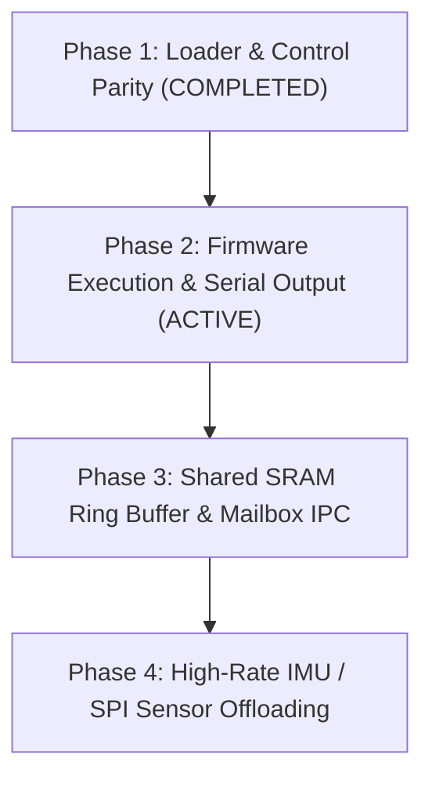

# XuanTie E907 RISC-V Co-Processor Implementation & Tracking Plan

**Current Milestone:** Phase 2 — Firmware Execution & Telemetry  
**Target Hardware:** Radxa Cubie A5E (Allwinner T527 / A527)  
**Co-Processor:** XuanTie E907 RISC-V (RV32IMAC @ 600 MHz)  
**Build System:** Buildroot Out-of-Tree (`BR2_EXTERNAL=project-cubie-a5e`)

---

## Core Architecture Principles

1. **100% Build-From-Source**:
   - Zero pre-compiled binaries, objects, or images in Git.
   - All host utilities (`riscv-load`), firmware (`firmware.bin`), and tools are compiled natively from source during the Buildroot build.
2. **Strict `BR2_EXTERNAL` Out-of-Tree Separation**:
   - `project-cubie-a5e/` is the clean external tree.
   - Build directories (`bld.a5e/`, `bld.a7a/`) build out-of-tree (`O=../bld.a5e`).
   - Rootfs overlays contain **only configuration files, scripts, and runtime assets** — never compiled binaries.
3. **No Hidden Overrides**:
   - Every package (`riscv-firmware`, `rbb-server`, etc.) is fully declared in `package/` and installs to `$(TARGET_DIR)`.

---

## Roadmap



---

## Active & Upcoming Phases

### Phase 1: Loader & Control Parity ✅ (Completed)
- [x] Fixed `riscv-load.c` (v1.1.0) to map CCU, copy firmware directly into ITCM (`0x07110000`), check dual-bit reset register status, and support live `monitor`.
- [x] Fixed `load-riscv.sh` (v1.1.0) smart delegator searching `$SCRIPT_DIR/riscv-load`, `/usr/bin/riscv-load`, and `$PATH`. Removed all broken shell fallbacks.
- [x] Synchronized `riscv-firmware.mk` to install both binary and wrapper script in target `/usr/bin/`.
- [x] Documented complete root-cause autopsy in [`docs/buildroot/RISCV_LOADER_REVIEW.md`](RISCV_LOADER_REVIEW.md).

### Phase 2: Firmware Execution & Telemetry (Active Milestone)
- [ ] Verify clean execution of `firmware.bin` in ITCM (`0x00000000` / host `0x07110000`).
- [ ] Validate `melis_hello_world.c` UART0 console output (`0x02500000`).
- [ ] Validate stack setup in DTCM (`0x07120000`), `.text` in SRAM C (`0x07130000`), and vector table jumps.

### Phase 3: Shared SRAM Ring Buffer & Mailbox IPC
- [ ] Configure Allwinner Message Box (`0x03003000`) for bidirectional doorbell IRQs (ARM GIC IRQ 147 / RISC-V PLIC).
- [ ] Allocate 32KB shared SRAM C window (`0x00078000` - `0x0007FFFF`) for lock-free circular ring buffer.
- [ ] Test `host_coprocessor_example.c` Linux userspace client reading live data packets.

### Phase 4: High-Rate IMU & Sensor Fusion Offloading
- [ ] Bring up low-latency SPI0 IMU acquisition driver directly on XuanTie E907 at 1kHz - 4kHz.
- [ ] Stream pre-filtered orientation / IMU packets to isolated Linux Core 7.

---

## Quick Reference Commands

- **Compile RISC-V Firmware standalone:**
  ```bash
  make -C riscv-firmware
  ```
- **Deploy to board:**
  ```bash
  scp riscv-firmware/riscv-load root@<IP>:/usr/bin/
  scp riscv-firmware/load-riscv.sh root@<IP>:/usr/bin/
  scp riscv-firmware/firmware.bin root@<IP>:/lib/firmware/riscv-firmware.bin
  ssh root@<IP> "chmod +x /usr/bin/riscv-load /usr/bin/load-riscv.sh"
  ```
- **Run on board:**
  ```bash
  /usr/bin/load-riscv.sh version
  /usr/bin/load-riscv.sh start /lib/firmware/riscv-firmware.bin
  /usr/bin/load-riscv.sh status
  ```
