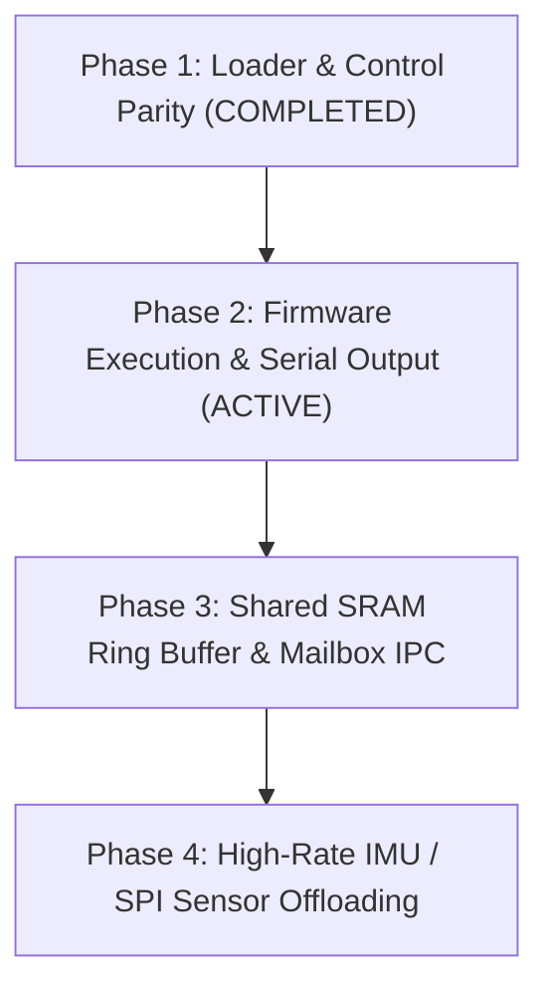

# XuanTie E907 RISC-V Co-Processor Implementation & Tracking Plan

**Current Milestone:** Phase 2 — Firmware Execution & Telemetry  
**Primary Platform:** Radxa Cubie A5E (Allwinner T527 / A527)  
**Secondary Platform:** Radxa Cubie A7A (Allwinner A733) — See [**`A7A Mainline Bring-Up Plan`**](../platforms/A7A_MAINLINE_PLAN.md)  
**Co-Processor:** XuanTie E907 RISC-V (RV32IMAC @ 600 MHz)  
**Build System:** Buildroot Out-of-Tree (`BR2_EXTERNAL=project-cubie-a5e`)

---

## Core Architecture Principles

1. **100% Build-From-Source**:
   - Zero pre-compiled binaries, objects, or images in Git.
   - All host utilities (`riscv-load`), firmware (`firmware.bin`), and tools are compiled natively from source during the Buildroot build.
2. **Strict `BR2_EXTERNAL` Out-of-Tree Separation**:
   - `project-cubie-a5e/` is the clean external tree.
   - Build directories (`bld.a5e/`, `bld.a7a/`) build out-of-tree (`O=../bld.a5e`).
   - Rootfs overlays contain **only configuration files, scripts, and runtime assets** — never compiled binaries.
3. **No Hidden Overrides**:
   - Every package (`riscv-firmware`, `rbb-server`, etc.) is fully declared in `package/` and installs to `$(TARGET_DIR)`.

---

## Roadmap



---

## Active & Upcoming Phases

## Active & Upcoming Phases

### Phase 1: Remoteproc Lifecycle & Hardware Debug Validation ✅ (Completed / Standardized)
- [x] Standardized on Linux Mainline `remoteproc` framework via [`sunxi_rproc.c`](../ALLWINNER_RISCV_REMOTEPROC_GUIDE.md), ensuring robust in-kernel lifecycle management.
- [x] Implemented automated Python DMI verification test harness (`tools/dmi_test.py`) to query RISC-V Debug Module status (`dmstatus` at DMI `0x11`) over OpenOCD.
- [x] Documented complete root-cause autopsy of legacy userspace loader in [`docs/buildroot/DebugLog.md`](DebugLog.md) (Case Study 6).

### Phase 2: Firmware Execution & Telemetry (Active Milestone)
- [ ] Deploy `firmware.elf` via remoteproc sysfs (`/sys/class/remoteproc/remoteproc0/state`).
- [ ] Verify execution of vector table and CRT0 in PubSRAM C (`0x00020000`) / Dedicated MCU SRAM (`0x3FFC0000`).
- [ ] Verify live trace log streaming via debugfs (`/sys/kernel/debug/remoteproc/remoteproc0/trace0`).

### Phase 3: Shared SRAM Ring Buffer & Mailbox IPC
- [ ] Configure Allwinner Message Box (`0x03003000`) for bidirectional doorbell IRQs (ARM GIC IRQ 147 / RISC-V PLIC).
- [ ] Allocate 32KB shared SRAM C window (`0x00078000` - `0x0007FFFF`) for lock-free circular ring buffer.
- [ ] Test `host_coprocessor_example.c` Linux userspace client reading live data packets.

### Phase 4: High-Rate IMU & Sensor Fusion Offloading
- [ ] Bring up low-latency SPI0 IMU acquisition driver directly on XuanTie E907 at 1kHz - 4kHz.
- [ ] Stream pre-filtered orientation / IMU packets to isolated Linux Core 7.

---

## Quick Reference Commands (RemoteProc Standard)

- **Compile RISC-V Firmware standalone:**
  ```bash
  make -C riscv-firmware
  ```
- **Deploy to board:**
  ```bash
  scp riscv-firmware/firmware.elf root@<IP>:/lib/firmware/riscv-firmware.elf
  ```
- **Boot and verify on board via RemoteProc:**
  ```bash
  echo "riscv-firmware.elf" > /sys/class/remoteproc/remoteproc0/firmware
  echo start > /sys/class/remoteproc/remoteproc0/state
  cat /sys/class/remoteproc/remoteproc0/state
  # Read live firmware trace output:
  cat /sys/kernel/debug/remoteproc/remoteproc0/trace0
  ```
- **Monitor co-processor serial output (`S_UART0`):**
  ```bash
  minicom -D /dev/ttyS0 -b 115200
  ```


