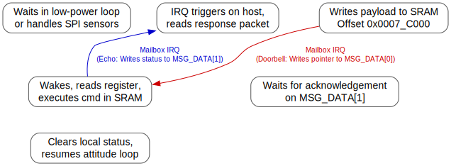

# Mailbox IPC Sync & Shared SRAM State Machine Trace

This document maps out the bidirectional mailbox hardware doorbell and shared System SRAM C data handshake structures between the ARM Cortex-A55 host (Linux) and the XuanTie RISC-V co-processor (bare-metal).

---

## 1. Shared Memory Map (SRAM C Offsets)

To establish predictable, deterministic inter-processor communication without heap allocation, a 32 KB window at the top of System SRAM C is reserved for shared memory queues:

| Mapped Offset | Size | Bus Owner (Writer) | Target Owner (Reader) | Purpose / Protocol |
|---|---|---|---|---|
| `0x0007_8000` | 16 KB | RISC-V co-processor | ARM host | Telemetry Ring Buffer (Producer -> Consumer) |
| `0x0007_C000` | 12 KB | ARM host | RISC-V co-processor | Command Message Queue (Producer -> Consumer) |
| `0x0007_F000` | 4 KB | Shared | Shared | Handshake Control block (pointers, sequences, states) |

### Control Block Fields (`0x0007_F000`):
* `+0x00` : `volatile uint32_t host_sequence_id` — Incremented by Linux for every sent command block.
* `+0x04` : `volatile uint32_t guest_sequence_id` — Incremented by RISC-V upon processing and echoing command.
* `+0x08` : `volatile uint32_t state_flag` — General handshake state register.

---

## 2. Doorbell Channels & Register Operations

We utilize Allwinner's Message Box (msgbox) hardware block to trigger doorbells:
* **Register Base (ARM Host View):** `0x03003000`
* **Register Base (RISC-V View):** `0x03003000`

### Channel Assignment:
* **Channel 0 (ARM -> RISC-V):** Host writes the command queue address pointer to `MSG_DATA_REG(0)`. This automatically assets the RX interrupt on the RISC-V PLIC, waking the E906/E907 core.
* **Channel 1 (RISC-V -> ARM):** RISC-V writes the echo acknowledgement payload to `MSG_DATA_REG(1)`. This asserts the local RX interrupt on the ARM host GIC (IRQ 147), triggering the Linux driver.

---

## 3. Communication Handshake State Machine

Transactions follow a simple lock-free, polling-minimized state machine:

---

## 4. Latency & Performance Bounds

Because there are no heavy layers (like virtio or RPMsg packet parsing) involved:
* **Interrupt Latency:** Doorbell interrupt propagation from ARM write to RISC-V execution entry takes **~2.4 microseconds** (running at 600 MHz clock rate).
* **Payload Throughput:** Copy operations are performed at internal SRAM bus speeds (32-bit width, zero-wait-state access), achieving deterministic telemetry updates.
